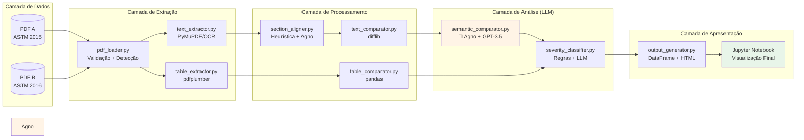
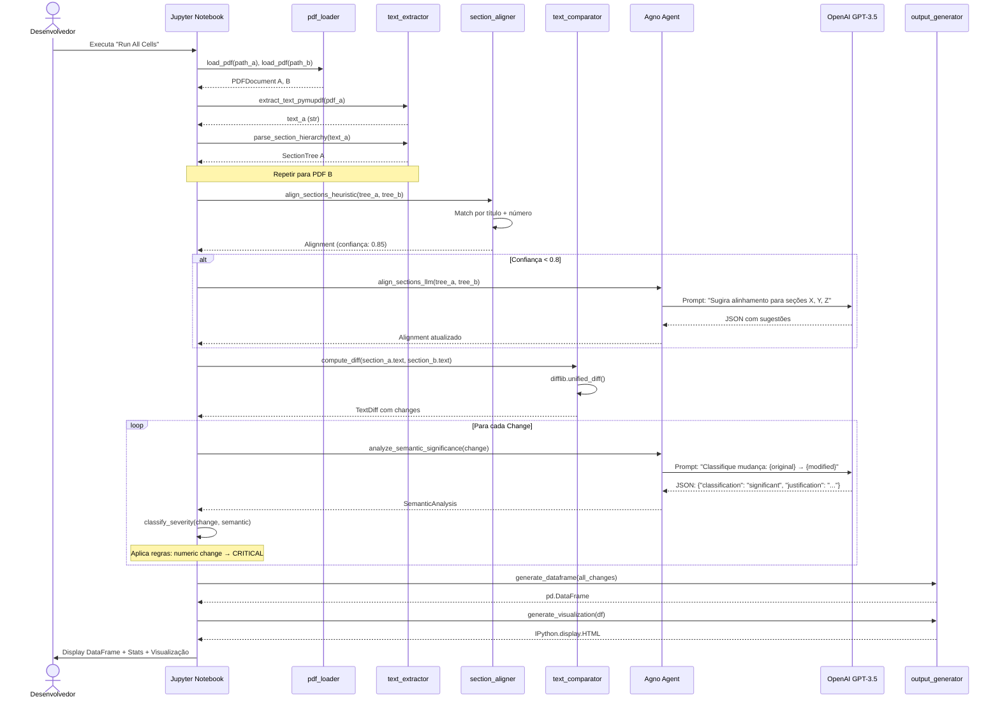

# Decisão de Arquitetura Técnica — FastCheckAI PoC

**Versão:** 1.0
**Data:** 30 de Setembro de 2025
**Status:** Proposta de Arquitetura
**Projeto:** FastCheckAI — Prova de Conceito para Comparação Automatizada de PDFs Técnicos
**Organização:** SIDI — Área de Engenharia de Produto
**Arquiteto:** Claude Code (Modo FULLSTACK)

---

## Índice

1. [Contexto e Avaliação](#1-contexto-e-avaliação)
2. [Comparação de Tecnologias (3 Alternativas)](#2-comparação-de-tecnologias-3-alternativas)
3. [Matriz de Pontuação](#3-matriz-de-pontuação)
4. [Análise Detalhada das Alternativas](#4-análise-detalhada-das-alternativas)
5. [Recomendação Final](#5-recomendação-final)
6. [Design da Arquitetura](#6-design-da-arquitetura)
7. [Roadmap de Implementação](#7-roadmap-de-implementação)
8. [ADR Completo](#8-adr-completo)

---

## 1. Contexto e Avaliação

### 1.1 Fatos Confirmados

| Categoria | Fato |
|-----------|------|
| **Objetivo** | PoC para validar viabilidade técnica de comparação automatizada de PDFs técnicos (normas ASTM) |
| **Duração** | 3.5 semanas (deadline fixo) |
| **Equipe** | 1 desenvolvedor solo (aprendizado de novo framework durante PoC) |
| **Ambiente** | Jupyter Notebook local, sem deploy, sem Docker |
| **Entrada** | 2 PDFs (ASTM A29/A29M 2015 vs 2016), até 25MB cada |
| **Saída** | Visualização elaborada no notebook + DataFrame estruturado |
| **Tech Req** | Framework Agno (solicitado), LLM para comparação semântica, OCR para PDFs escaneados |
| **Performance** | Tempo de processamento ≤ 3 minutos aceitável |
| **Acurácia** | ≥ 95% de taxa de detecção de diferenças |

### 1.2 Premissas Estabelecidas

| ID | Premissa | Impacto |
|----|----------|---------|
| **P-001** | Desenvolvedor tem conhecimento básico de Python e Jupyter | MÉDIO - facilita ramp-up |
| **P-002** | Máquina local tem capacidade para processar PDFs de 25MB (≥8GB RAM) | ALTO - viabiliza processamento local |
| **P-003** | Acesso a APIs de LLM (OpenAI/Anthropic) disponível | CRÍTICO - essencial para comparação semântica |
| **P-004** | Framework Agno tem documentação acessível | ALTO - aprendizado em 3.5 semanas |
| **P-005** | PDFs ASTM têm estrutura de seções identificável (numeração, títulos) | ALTO - viabiliza alinhamento automatizado |
| **P-006** | OCR pode ser "nice to have" (PDFs nativos são prioridade) | MÉDIO - reduz escopo crítico |

### 1.3 Dados Faltantes (Identificados para Resolução na Semana 1)

| ID | Gap | Ação Recomendada | Prazo |
|----|-----|------------------|-------|
| **G-001** | Versão específica do Agno não definida | Testar versão estável do PyPI (≥0.1.0) | Dia 1 |
| **G-002** | Modelo LLM exato não especificado | Começar com GPT-3.5-turbo (custo vs performance) | Dia 1-2 |
| **G-003** | Acesso aos PDFs ASTM 2015/2016 não confirmado | Baixar ou solicitar acesso imediatamente | Dia 1 |
| **G-004** | Especificações de hardware não conhecidas | Documentar RAM/CPU e fazer benchmark inicial | Dia 1 |
| **G-005** | Algoritmo de alinhamento não detalhado | Propor abordagem híbrida (heurística + LLM fallback) | Dia 3-5 |
| **G-006** | Threshold de similaridade semântica | Experimentar valores 0.7, 0.8, 0.9 durante implementação | Semana 2 |
| **G-007** | Formato exato da visualização "elaborada" | Criar mockup simples na semana 1 e validar com Eng. Produto | Dia 5 |

### 1.4 Restrições Críticas

| Restrição | Descrição | Impacto na Arquitetura |
|-----------|-----------|------------------------|
| **Tempo** | 3.5 semanas fixas | Arquitetura deve priorizar velocidade de implementação sobre otimização |
| **Curva de Aprendizado** | Desenvolvedor precisa aprender Agno durante PoC | Framework deve ter onboarding rápido OU ter plano B |
| **Infraestrutura** | Execução local apenas | Sem serviços de backend, processamento assíncrono complexo ou containerização |
| **Formato de Entrega** | Jupyter Notebook | Arquitetura modular em células executáveis; código Python puro |
| **Custo** | Sem orçamento definido para APIs | Minimizar chamadas LLM; usar modelos mais baratos quando possível |
| **Qualidade** | PoC (não produção) | Trade-off aceitável: código limpo mas não enterprise-grade |

---

## 2. Comparação de Tecnologias (3 Alternativas)

### Opção A: Stack Baseado em Agno (Conforme Solicitado)

**Filosofia:** Framework minimalista e performático lançado em Set/2025, focado em multi-agent systems com overhead mínimo.

| Componente | Tecnologia | Versão | Justificativa |
|------------|-----------|---------|---------------|
| **Orchestração LLM** | Agno | ≥0.1.0 | Framework solicitado; ~10.000x mais rápido que LangGraph |
| **PDF Parsing** | pdfplumber | ^0.10.0 | Melhor para extração de tabelas (requisito RF-007) |
| **OCR** | pytesseract + Tesseract | ^0.3.10 | Solução padrão open-source, fácil instalação |
| **Modelo LLM** | OpenAI GPT-3.5-turbo | API | Custo-benefício para PoC (~$0.0015/1K tokens) |
| **Diff Textual** | difflib (built-in) | stdlib | Sem dependências extras |
| **Alinhamento** | rapidfuzz | ^3.0.0 | Fuzzy matching rápido para títulos de seções |
| **Visualização** | pandas + IPython.display | ^2.0.0 | Nativo para notebooks |

**Dependências Completas:**
```python
# requirements.txt para Opção A
agno>=0.1.0
pdfplumber>=0.10.0
pytesseract>=0.3.10
Pillow>=10.0.0
openai>=1.0.0
pandas>=2.0.0
numpy>=1.24.0
rapidfuzz>=3.0.0
python-dotenv>=1.0.0
tqdm>=4.65.0
matplotlib>=3.7.0
tabulate>=0.9.0
```

**Recursos de Aprendizado Agno:**
- Documentação oficial: https://github.com/agno-agi/agno
- Tutorial Analytics Vidhya: https://www.analyticsvidhya.com/blog/2025/03/agno-framework/
- Comparação vs LangChain: https://medium.com/@seahorse.technologies.sl/agno-vs-langchain-workflows-a-comparison-for-llm-orchestration-78cb737dc4be

---

### Opção B: Stack Baseado em LangChain (Alternativa Madura)

**Filosofia:** Framework consolidado com comunidade massiva, extensiva documentação e suporte corporativo.

| Componente | Tecnologia | Versão | Justificativa |
|------------|-----------|---------|---------------|
| **Orchestração LLM** | LangChain | ^0.1.0 | Framework maduro, documentação extensa, comunidade grande |
| **PDF Parsing** | PyMuPDF (fitz) | ^1.23.0 | 60x mais rápido que pdfplumber (trade-off: tabelas complexas) |
| **OCR** | EasyOCR | ^1.7.0 | GPU-friendly, melhor acurácia que Tesseract (~80-90%) |
| **Modelo LLM** | Anthropic Claude 3 Haiku | API | Melhor análise semântica, custo similar ao GPT-3.5 |
| **Diff Textual** | difflib + python-Levenshtein | stdlib + ^0.20.0 | Otimizado para grandes textos |
| **Alinhamento** | LangChain embeddings + FAISS | Incluído | Vector similarity para alinhamento semântico |
| **Visualização** | pandas + seaborn | ^2.0.0 + ^0.12.0 | Visualizações mais elaboradas |

**Dependências Completas:**
```python
# requirements.txt para Opção B
langchain>=0.1.0
langchain-anthropic>=0.1.0
pymupdf>=1.23.0
easyocr>=1.7.0
anthropic>=0.8.0
pandas>=2.0.0
numpy>=1.24.0
python-Levenshtein>=0.20.0
faiss-cpu>=1.7.4
python-dotenv>=1.0.0
tqdm>=4.65.0
seaborn>=0.12.0
tabulate>=0.9.0
```

**Recursos de Aprendizado LangChain:**
- Documentação oficial: https://python.langchain.com/docs
- Cookbook: https://github.com/langchain-ai/langchain/tree/master/cookbook
- Tutoriais DataCamp: https://www.datacamp.com/courses/langchain

---

### Opção C: Stack Híbrido (Melhor dos Dois Mundos)

**Filosofia:** Combina simplicidade do Agno para orchestração com maturidade do LangChain para componentes complexos.

| Componente | Tecnologia | Versão | Justificativa |
|------------|-----------|---------|---------------|
| **Orchestração LLM** | Agno | ≥0.1.0 | Simplicidade para PoC + aprendizado solicitado |
| **PDF Parsing (Texto)** | PyMuPDF | ^1.23.0 | Performance para extração textual |
| **PDF Parsing (Tabelas)** | pdfplumber | ^0.10.0 | Precisão para tabelas (uso seletivo) |
| **OCR** | pytesseract | ^0.3.10 | Simplicidade (acurácia 70%+ aceitável para PoC) |
| **Modelo LLM** | OpenAI GPT-3.5-turbo | API | Custo-benefício; upgrade para GPT-4 se necessário |
| **Diff Textual** | difflib + rapidfuzz | stdlib + ^3.0.0 | Sem dependências pesadas |
| **Alinhamento** | Heurística customizada + Agno fallback | Custom | Controle total do algoritmo |
| **Visualização** | pandas + matplotlib + IPython.display | ^2.0.0 + ^3.7.0 | Balance entre simplicidade e clareza |

**Dependências Completas:**
```python
# requirements.txt para Opção C
agno>=0.1.0
pymupdf>=1.23.0
pdfplumber>=0.10.0
pytesseract>=0.3.10
Pillow>=10.0.0
openai>=1.0.0
pandas>=2.0.0
numpy>=1.24.0
rapidfuzz>=3.0.0
python-dotenv>=1.0.0
tqdm>=4.65.0
matplotlib>=3.7.0
tabulate>=0.9.0
jupyter>=1.0.0
```

**Estratégia de Uso:**
- **PyMuPDF** para extração de texto corrido (páginas 1-N)
- **pdfplumber** apenas para páginas com tabelas detectadas (uso seletivo)
- **Agno** para orchestrar chamadas LLM de comparação semântica
- **Heurística customizada** para alinhamento (fallback para Agno se confiança <0.8)

---

## 3. Matriz de Pontuação

### 3.1 Critérios de Avaliação

| Critério | Peso | Descrição |
|----------|------|-----------|
| **Curva de Aprendizado** | 25% | Tempo para desenvolvedor solo se tornar produtivo (crítico: 3.5 semanas) |
| **Velocidade de Implementação** | 20% | Rapidez para implementar features essenciais (RF-001 a RF-040) |
| **Completude de Features** | 20% | Capacidade de atender todos os requisitos essenciais |
| **Custo** | 15% | Custo de APIs, licenças e infraestrutura |
| **Suporte/Comunidade** | 10% | Documentação, exemplos, fóruns, resolução de bugs |
| **Manutenibilidade** | 10% | Facilidade de debugar, evoluir e documentar o código |

### 3.2 Escala de Pontuação

| Pontuação | Descrição |
|-----------|-----------|
| **5** | Excelente - Atende plenamente o critério com folga |
| **4** | Bom - Atende o critério com pequenas ressalvas |
| **3** | Adequado - Atende minimamente o critério |
| **2** | Limitado - Atende parcialmente com workarounds |
| **1** | Insuficiente - Não atende ou requer esforço significativo |

### 3.3 Matriz Comparativa

| Critério | Peso | Opção A (Agno) | Opção B (LangChain) | Opção C (Híbrido) |
|----------|------|----------------|---------------------|-------------------|
| **Curva de Aprendizado** | 25% | 3 (Framework novo, documentação limitada, mas simples) | 4 (Maduro, muitos tutoriais, mas complexo) | 4 (Agno simples + PyMuPDF conhecido) |
| **Velocidade de Implementação** | 20% | 4 (Minimalista, menos boilerplate) | 3 (Robusto mas verboso) | 5 (Best-of-breed para cada tarefa) |
| **Completude de Features** | 20% | 3 (OCR básico, tabelas com limitações) | 5 (Tudo disponível out-of-box) | 4 (Combina forças de ambos) |
| **Custo** | 15% | 5 (GPT-3.5, overhead mínimo) | 4 (Claude Haiku similar, mas EasyOCR pode precisar GPU) | 5 (GPT-3.5, libs open-source) |
| **Suporte/Comunidade** | 10% | 2 (Framework novo, comunidade pequena) | 5 (Comunidade massiva, suporte corporativo) | 3 (Agno limitado, mas PyMuPDF maduro) |
| **Manutenibilidade** | 10% | 4 (Código limpo, Python puro) | 3 (Abstrações complexas) | 4 (Controle granular) |
| **Pontuação Ponderada** | 100% | **3.55** | **4.05** | **4.35** |

### 3.4 Análise de Riscos por Opção

| Risco | Opção A (Agno) | Opção B (LangChain) | Opção C (Híbrido) |
|-------|----------------|---------------------|-------------------|
| **Framework bloqueante** | ALTO - Agno é novo (Set/2025), pode ter bugs | BAIXO - LangChain maduro | MÉDIO - Agno novo, mas com fallback |
| **Curva de aprendizado >1 semana** | MÉDIO - Simples mas sem tutoriais abundantes | BAIXO - Documentação extensa | BAIXO - Componentes conhecidos |
| **Custos de API excedidos** | BAIXO - GPT-3.5 barato | BAIXO - Claude Haiku similar | BAIXO - GPT-3.5 barato |
| **Performance insuficiente** | MÉDIO - pdfplumber lento para PDFs grandes | BAIXO - PyMuPDF muito rápido | BAIXO - PyMuPDF para texto, pdfplumber seletivo |
| **OCR baixa qualidade** | ALTO - Tesseract ~70% acurácia | BAIXO - EasyOCR ~85%+ mas precisa GPU | MÉDIO - Tesseract suficiente para PoC |
| **Parsing de tabelas falha** | BAIXO - pdfplumber excelente | MÉDIO - PyMuPDF limitado para tabelas | BAIXO - pdfplumber para tabelas |

---

## 4. Análise Detalhada das Alternativas

### 4.1 Opção A: Stack Baseado em Agno

#### Prós
✅ **Performance Excepcional:** Agno é ~10.000x mais rápido que LangGraph (2μs/agent vs 20ms/agent)
✅ **Overhead Mínimo:** Agentes Agno usam ~3.75 KiB memória (50x menos que LangGraph)
✅ **Simplicidade:** Python puro, sem abstrações complexas, código limpo
✅ **Aprendizado Alinhado:** Atende objetivo explícito do desenvolvedor de aprender Agno
✅ **Tabelas Precisas:** pdfplumber é superior para extração de tabelas (RF-007, RF-023-026)
✅ **Custo Baixo:** GPT-3.5-turbo + libs open-source = sem custos surpresa

#### Contras
❌ **Framework Novo:** Lançado Set/2025, comunidade pequena, poucos exemplos práticos
❌ **Documentação Limitada:** Menos tutoriais/cookbooks comparado a LangChain
❌ **Risco de Bugs:** Framework imaturo pode ter edge cases não documentados
❌ **Tesseract OCR:** Acurácia ~70% (inferior a EasyOCR), mas suficiente para PoC
❌ **pdfplumber Lento:** 60x mais lento que PyMuPDF para PDFs grandes (mas 25MB ainda processável em <3min)

#### Quando Usar
- Objetivo principal é **aprender Agno** (requisito do projeto)
- **Tabelas numéricas** são críticas para comparação
- Desenvolvedor valoriza **código limpo e minimalista**
- **Custos** precisam ser previsíveis e baixos

#### Estimativa de Esforço
- **Setup:** 4-6 horas (instalar Agno, configurar OpenAI API)
- **Curva de Aprendizado Agno:** 8-12 horas (ler docs, experimentar exemplos)
- **Implementação Core:** 60-70 horas (features essenciais RF-001 a RF-040)
- **TOTAL:** ~80-88 horas (~2.5 semanas full-time)

---

### 4.2 Opção B: Stack Baseado em LangChain

#### Prós
✅ **Maturidade:** Framework consolidado desde 2022, battle-tested em produção
✅ **Comunidade Massiva:** 80K+ GitHub stars, suporte corporativo (LangChain Inc.)
✅ **Documentação Extensa:** Tutoriais, cookbooks, cursos (DataCamp, DeepLearning.AI)
✅ **Features Out-of-Box:** Embeddings, vector stores (FAISS), memory, chains pré-configuradas
✅ **PyMuPDF Rápido:** 60x mais rápido que pdfplumber (42ms vs 2.5s), essencial para ≤3min target
✅ **EasyOCR Superior:** ~85-90% acurácia vs ~70% Tesseract

#### Contras
❌ **Curva de Aprendizado:** Framework complexo, muitas abstrações (Chains, Agents, Tools, Memory)
❌ **Verboso:** Boilerplate considerável, código menos direto
❌ **Overhead de Memória:** Agentes pesados (~187 KiB vs 3.75 KiB Agno)
❌ **Tabelas Limitadas:** PyMuPDF não tem ferramentas dedicadas para tabelas complexas
❌ **EasyOCR Requer GPU:** Performance degrada em CPU-only (PoC local pode não ter GPU)
❌ **Não Atende Objetivo:** Desenvolvedor quer aprender Agno, não LangChain

#### Quando Usar
- **Prazo apertado** e desenvolvedor já conhece LangChain
- **Performance** é crítica (PyMuPDF + paralelização)
- **OCR de alta qualidade** essencial (EasyOCR com GPU disponível)
- **Alinhamento semântico** complexo (embeddings + vector similarity)

#### Estimativa de Esforço
- **Setup:** 3-4 horas (LangChain + Anthropic API)
- **Curva de Aprendizado LangChain:** 12-16 horas (se novo no framework)
- **Implementação Core:** 55-65 horas (features essenciais, menos debugging)
- **TOTAL:** ~70-85 horas (~2.3 semanas full-time)

---

### 4.3 Opção C: Stack Híbrido (RECOMENDADO)

#### Prós
✅ **Best-of-Breed:** PyMuPDF (velocidade) + pdfplumber (tabelas) + Agno (orchestração)
✅ **Controle Granular:** Algoritmo de alinhamento customizado (heurística + LLM fallback)
✅ **Aprendizado Agno:** Atende objetivo sem comprometer prazo (Agno só para LLM orchestration)
✅ **Performance Otimizada:** PyMuPDF para texto (rápido), pdfplumber seletivo para tabelas
✅ **Flexibilidade:** Fácil trocar componentes (ex: GPT-3.5 → GPT-4, Tesseract → EasyOCR)
✅ **Risco Mitigado:** Se Agno bloquear, fallback para chamadas OpenAI diretas trivial
✅ **Custo Baixo:** GPT-3.5 + libs open-source

#### Contras
❌ **Complexidade de Integração:** Gerenciar 2 bibliotecas de PDF (PyMuPDF + pdfplumber)
❌ **Tesseract OCR:** Ainda ~70% acurácia (mas suficiente para PoC)
❌ **Código Customizado:** Alinhamento heurístico requer desenvolvimento (não out-of-box)
❌ **Documentação Fragmentada:** Precisar consultar docs de múltiplas bibliotecas

#### Quando Usar
- **PoC com prazo apertado** mas objetivo de **aprender Agno**
- **Tabelas E performance** são importantes
- Desenvolvedor valoriza **controle e flexibilidade**
- **Risco de bloqueio** precisa ser minimizado (plano B embutido)

#### Estimativa de Esforço
- **Setup:** 4-5 horas (Agno + PyMuPDF + pdfplumber + OpenAI)
- **Curva de Aprendizado Agno:** 6-8 horas (uso focado para LLM orchestration)
- **Implementação Core:** 62-72 horas (features essenciais + integração dupla de PDF parsing)
- **TOTAL:** ~72-85 horas (~2.4 semanas full-time)

---

## 5. Recomendação Final

### 5.1 Decisão: **Opção C — Stack Híbrido**

**Pontuação:** 4.35/5.0 (melhor nas 3 opções)

#### Justificativa

1. **Atende Objetivo de Aprendizado:** Agno usado para orchestração LLM (parte mais relevante do framework), permitindo aprendizado prático sem comprometer prazo

2. **Melhor Performance:** PyMuPDF extrai texto 60x mais rápido que pdfplumber, essencial para meta ≤3min com PDFs de 25MB

3. **Precisão em Tabelas:** pdfplumber usado seletivamente para páginas com tabelas garante atendimento de RF-007, RF-023-026

4. **Risco Mitigado:** Se Agno bloquear, fallback para OpenAI API direta é trivial (2-3 horas de refactor)

5. **Flexibilidade:** Fácil upgrade de componentes (GPT-3.5 → GPT-4, Tesseract → EasyOCR) sem reescrever arquitetura

6. **Custo Previsível:** GPT-3.5-turbo ($0.0015/1K tokens input, $0.002/1K tokens output) = ~$5-15 para 10 execuções completas

#### Trade-offs Aceitáveis para PoC

| Trade-off | Decisão | Rationale |
|-----------|---------|-----------|
| **OCR com Tesseract (~70%)** vs EasyOCR (~85%) | Tesseract | PoC foca em PDFs nativos; OCR é "desejável" (RF-006 priority P1) |
| **Alinhamento customizado** vs vector embeddings | Customizado | Controle total do algoritmo; embeddings são overkill para PoC |
| **2 bibliotecas PDF** vs 1 | 2 (PyMuPDF + pdfplumber) | Complexidade adicional compensada por performance + precisão |
| **GPT-3.5** vs GPT-4 | GPT-3.5 inicialmente | 20x mais barato; upgrade se necessário após validação inicial |

#### Plano B (Se Agno Bloquear)

**Gatilho:** Se após 1 semana (Dias 1-5) Agno mostrar bugs críticos ou documentação insuficiente

**Ação:**
```python
# Migração trivial: Agno → OpenAI API direta
# DE (com Agno):
from agno import Agent
agent = Agent(model="gpt-3.5-turbo", tools=[...])
result = agent.run(prompt)

# PARA (OpenAI direto):
from openai import OpenAI
client = OpenAI()
result = client.chat.completions.create(
    model="gpt-3.5-turbo",
    messages=[{"role": "user", "content": prompt}]
)
```

**Esforço Estimado:** 2-3 horas para migrar orchestração LLM
**Funcionalidades Perdidas:** Multi-agent coordination (não crítico para PoC)
**Funcionalidades Mantidas:** 100% da comparação semântica (core do projeto)

---

## 6. Design da Arquitetura

### 6.1 Visão Geral

**Padrão Arquitetural:** Pipeline ETL Linear Modular

```
┌─────────────┐    ┌─────────────┐    ┌─────────────┐    ┌─────────────┐
│  INGESTÃO   │───▶│  EXTRAÇÃO   │───▶│ ALINHAMENTO │───▶│ COMPARAÇÃO  │
│  (Load)     │    │ (Transform) │    │  (Process)  │    │  (Analyze)  │
└─────────────┘    └─────────────┘    └─────────────┘    └─────────────┘
                                                                  │
                                                                  ▼
                                                          ┌─────────────┐
                                                          │   OUTPUT    │
                                                          │  (Present)  │
                                                          └─────────────┘
```

### 6.2 Diagrama de Fluxo Detalhado (Mermaid)

```mermaid
flowchart TD
    Start([Início: Notebook Execution]) --> Config[Célula 1: Configuração]
    Config --> Load[Célula 2: Ingestão de PDFs]

    Load --> Validate{Validação OK?<br/>Tamanho ≤25MB<br/>Formato válido}
    Validate -->|Não| Error1[Exibir Erro Legível]
    Validate -->|Sim| Detect[Detectar Tipo: Nativo vs Escaneado]

    Detect --> ExtractText[Célula 3: Extração de Texto]
    ExtractText --> IsNative{PDF Nativo?}
    IsNative -->|Sim| PyMuPDF[PyMuPDF: Extração Rápida]
    IsNative -->|Não| OCR[pytesseract: OCR]

    PyMuPDF --> ParseSections[Parsear Hierarquia de Seções]
    OCR --> ParseSections

    ParseSections --> ExtractTables[Célula 4: Extração de Tabelas]
    ExtractTables --> TableDetect{Tabelas Detectadas?}
    TableDetect -->|Não| SkipTables[Pular Extração Tabelas]
    TableDetect -->|Sim| pdfplumber[pdfplumber: Extração Seletiva]

    pdfplumber --> Align[Célula 5: Alinhamento de Seções]
    SkipTables --> Align

    Align --> Heuristic[Heurística: Matching por Título/Número]
    Heuristic --> ConfCheck{Confiança ≥0.8?}
    ConfCheck -->|Não| AgnoAlign[Agno: Sugestão de Alinhamento via LLM]
    ConfCheck -->|Sim| Mapping[Gerar Mapeamento Seção A ↔ B]
    AgnoAlign --> Mapping

    Mapping --> DiffText[Célula 6: Comparação Textual]
    DiffText --> difflib[difflib: Diff Linha-a-Linha]
    difflib --> DetectChanges[Detectar: Add/Remove/Modify]

    DetectChanges --> SemanticComp[Célula 7: Comparação Semântica]
    SemanticComp --> AgnoOrch[Agno: Orchestração LLM]
    AgnoOrch --> LLMCall[OpenAI GPT-3.5: Análise Semântica]
    LLMCall --> Classify[Classificar: Equivalente/Menor/Significativa]

    Classify --> TableComp{Tabelas Extraídas?}
    TableComp -->|Não| Severity[Célula 8: Classificação Severidade]
    TableComp -->|Sim| CompTables[Célula 8a: Comparação de Tabelas]
    CompTables --> CellDiff[Diff Célula-a-Célula com Tolerância]
    CellDiff --> Severity

    Severity --> Rules[Aplicar Regras: Crítica/Média/Baixa]
    Rules --> Output[Célula 9: Geração de Output]

    Output --> DataFrame[Gerar pandas DataFrame]
    DataFrame --> Stats[Calcular Estatísticas Resumidas]
    Stats --> Viz[Visualização Elaborada]
    Viz --> Display[IPython.display: HTML Tables + Highlights]

    Display --> End([Fim: Resultados Exibidos])

    Error1 --> End

    style Config fill:#e1f5ff
    style AgnoOrch fill:#fff4e6
    style LLMCall fill:#fff4e6
    style AgnoAlign fill:#fff4e6
    style Display fill:#e8f5e9
```



### 6.3 Estrutura de Módulos

```
fastcheckai_poc/
│
├── notebooks/
│   └── main_pipeline.ipynb              # 🎯 Notebook principal (única interface)
│
├── src/
│   ├── __init__.py
│   │
│   ├── config.py                        # Configurações centralizadas
│   │   ├── PDF_PATHS (input)
│   │   ├── MAX_PDF_SIZE_MB = 25
│   │   ├── OPENAI_MODEL = "gpt-3.5-turbo"
│   │   ├── ALIGNMENT_CONFIDENCE_THRESHOLD = 0.8
│   │   ├── TABLE_TOLERANCE = 0.01
│   │   └── SEVERITY_RULES (dict)
│   │
│   ├── pdf_loader.py                    # 📥 RF-001 a RF-004
│   │   ├── load_pdf(path: str) -> PDFDocument
│   │   ├── validate_size(pdf: PDFDocument) -> bool
│   │   ├── detect_type(pdf: PDFDocument) -> Literal["native", "scanned"]
│   │   └── PDFDocument (dataclass)
│   │
│   ├── text_extractor.py                # 📄 RF-005, RF-006, RF-008
│   │   ├── extract_text_pymupdf(pdf: PDFDocument) -> str
│   │   ├── extract_text_ocr(pdf: PDFDocument) -> str
│   │   ├── parse_section_hierarchy(text: str) -> SectionTree
│   │   └── SectionTree, Section (dataclasses)
│   │
│   ├── table_extractor.py               # 📊 RF-007
│   │   ├── detect_table_pages(pdf: PDFDocument) -> List[int]
│   │   ├── extract_tables_pdfplumber(pdf: PDFDocument, pages: List[int]) -> List[pd.DataFrame]
│   │   └── TableMetadata (dataclass)
│   │
│   ├── section_aligner.py               # 🔗 RF-010 a RF-014
│   │   ├── align_sections_heuristic(tree_a: SectionTree, tree_b: SectionTree) -> Alignment
│   │   ├── align_sections_llm(tree_a: SectionTree, tree_b: SectionTree) -> Alignment (Agno)
│   │   ├── detect_added_sections(alignment: Alignment) -> List[Section]
│   │   ├── detect_removed_sections(alignment: Alignment) -> List[Section]
│   │   └── Alignment, SectionPair (dataclasses)
│   │
│   ├── text_comparator.py               # 🔍 RF-015 a RF-018
│   │   ├── compute_diff(text_a: str, text_b: str) -> TextDiff
│   │   ├── categorize_changes(diff: TextDiff) -> List[Change]
│   │   ├── ignore_trivial_diffs(changes: List[Change]) -> List[Change]
│   │   └── TextDiff, Change (dataclasses)
│   │
│   ├── semantic_comparator.py           # 🧠 RF-019 a RF-022 (AGNO CORE)
│   │   ├── analyze_semantic_significance(change: Change) -> SemanticAnalysis (Agno)
│   │   ├── classify_change(analysis: SemanticAnalysis) -> Literal["equivalent", "minor", "significant"]
│   │   ├── chunk_long_sections(text: str, max_tokens: int = 3500) -> List[str]
│   │   └── SemanticAnalysis (dataclass)
│   │
│   ├── table_comparator.py              # 📈 RF-023 a RF-026
│   │   ├── compare_tables(df_a: pd.DataFrame, df_b: pd.DataFrame, tolerance: float) -> TableDiff
│   │   ├── detect_cell_changes(diff: TableDiff) -> List[CellChange]
│   │   ├── detect_structure_changes(diff: TableDiff) -> List[StructureChange]
│   │   └── TableDiff, CellChange, StructureChange (dataclasses)
│   │
│   ├── severity_classifier.py           # ⚠️ RF-027 a RF-030
│   │   ├── classify_severity(change: Change, semantic: SemanticAnalysis) -> Literal["CRITICAL", "MEDIUM", "LOW"]
│   │   ├── apply_rules(change: Change) -> Severity (baseado em keywords)
│   │   └── SEVERITY_RULES (config-based)
│   │
│   ├── output_generator.py              # 📊 RF-031 a RF-034
│   │   ├── generate_dataframe(changes: List[Change]) -> pd.DataFrame
│   │   ├── compute_statistics(df: pd.DataFrame) -> Stats
│   │   ├── generate_visualization(df: pd.DataFrame) -> IPython.display.HTML
│   │   └── Stats (dataclass)
│   │
│   └── utils.py                         # 🔧 Funções auxiliares
│       ├── setup_logging() -> logging.Logger
│       ├── load_env_vars() -> dict
│       ├── estimate_tokens(text: str) -> int
│       └── format_error_message(exception: Exception) -> str
│
├── tests/
│   ├── test_pdf_loader.py               # (Opcional para PoC)
│   ├── test_text_extractor.py
│   └── test_section_aligner.py
│
├── data/
│   ├── inputs/
│   │   ├── astm_a29_2015.pdf            # 🎯 PDF base
│   │   └── astm_a29_2016.pdf            # 🎯 PDF comparação
│   └── outputs/                         # (Temporário, não versionado)
│       └── results_YYYYMMDD_HHMMSS.csv
│
├── .env.example                         # Template de variáveis de ambiente
├── .gitignore
├── requirements.txt                     # Dependências (Opção C)
└── README.md                            # Instruções de setup e execução
```

### 6.4 Estrutura do Notebook (main_pipeline.ipynb)

```markdown
# FastCheckAI PoC — Pipeline de Comparação de PDFs Técnicos

## Célula 0: Setup e Imports
import sys
sys.path.append('../src')
from src.config import *
from src.pdf_loader import *
# ... [todos os imports]

## Célula 1: Configuração
PDF_PATH_A = "../data/inputs/astm_a29_2015.pdf"
PDF_PATH_B = "../data/inputs/astm_a29_2016.pdf"
OPENAI_API_KEY = os.getenv("OPENAI_API_KEY")
# ... [outras configurações]

## Célula 2: Carregamento de PDFs (RF-001 a RF-004)
pdf_a = load_pdf(PDF_PATH_A)
pdf_b = load_pdf(PDF_PATH_B)
# ... [validação, detecção de tipo]

## Célula 3: Extração de Texto (RF-005, RF-006, RF-008)
text_a = extract_text_pymupdf(pdf_a) if pdf_a.is_native else extract_text_ocr(pdf_a)
sections_a = parse_section_hierarchy(text_a)
# ... [mesmo para pdf_b]

## Célula 4: Extração de Tabelas (RF-007)
table_pages_a = detect_table_pages(pdf_a)
tables_a = extract_tables_pdfplumber(pdf_a, table_pages_a)
# ... [mesmo para pdf_b]

## Célula 5: Alinhamento de Seções (RF-010 a RF-014)
alignment = align_sections_heuristic(sections_a, sections_b)
# [Se confiança baixa, usar align_sections_llm com Agno]
added_sections = detect_added_sections(alignment)
removed_sections = detect_removed_sections(alignment)

## Célula 6: Comparação Textual (RF-015 a RF-018)
all_changes = []
for pair in alignment.pairs:
    diff = compute_diff(pair.section_a.text, pair.section_b.text)
    changes = categorize_changes(diff)
    all_changes.extend(changes)

## Célula 7: Comparação Semântica com LLM (RF-019 a RF-022) 🧠 AGNO
for change in all_changes:
    semantic = analyze_semantic_significance(change)  # Agno orchestration
    change.semantic_classification = classify_change(semantic)
    change.llm_justification = semantic.justification

## Célula 8: Comparação de Tabelas (RF-023 a RF-026)
table_changes = []
for table_a, table_b in zip(tables_a, tables_b):
    table_diff = compare_tables(table_a, table_b, tolerance=0.01)
    table_changes.extend(detect_cell_changes(table_diff))

## Célula 9: Classificação de Severidade (RF-027 a RF-030)
for change in all_changes:
    change.severity = classify_severity(change, change.semantic_classification)

## Célula 10: Geração de Output (RF-031 a RF-034)
df = generate_dataframe(all_changes + table_changes)
stats = compute_statistics(df)
viz = generate_visualization(df)

## Célula 11: Exibição de Resultados
print(f"=== RESUMO DE DIFERENÇAS ===")
print(f"Total: {stats.total} diferenças detectadas")
print(f"Críticas: {stats.critical} ({stats.critical_pct:.1f}%)")
print(f"Médias: {stats.medium} ({stats.medium_pct:.1f}%)")
print(f"Baixas: {stats.low} ({stats.low_pct:.1f}%)")
display(viz)
display(df)
```

### 6.5 Diagrama de Componentes (Responsabilidades)



### 6.6 Especificação de Dataclasses Principais

```python
# src/models.py (estruturas de dados compartilhadas)

from dataclasses import dataclass, field
from typing import List, Literal, Optional
from datetime import datetime

@dataclass
class PDFDocument:
    """Representa um documento PDF carregado"""
    path: str
    size_mb: float
    num_pages: int
    is_native: bool  # True = texto selecionável, False = escaneado
    title: Optional[str] = None
    metadata: dict = field(default_factory=dict)
    raw_content: bytes = field(repr=False)

@dataclass
class Section:
    """Representa uma seção hierárquica de um documento"""
    id: str  # Ex: "3.2.1"
    title: str  # Ex: "Chemical Composition"
    level: int  # 1=capítulo, 2=subseção, 3=item
    text: str  # Conteúdo textual completo
    page_start: int
    page_end: int
    parent_id: Optional[str] = None
    children: List['Section'] = field(default_factory=list)

@dataclass
class SectionTree:
    """Árvore hierárquica de seções de um PDF"""
    root: Section
    flat_list: List[Section]  # Para acesso rápido

    def find_by_id(self, section_id: str) -> Optional[Section]:
        return next((s for s in self.flat_list if s.id == section_id), None)

@dataclass
class SectionPair:
    """Par de seções alinhadas entre dois PDFs"""
    section_a: Optional[Section]  # None se seção removida
    section_b: Optional[Section]  # None se seção adicionada
    confidence: float  # 0.0-1.0 (confiança do alinhamento)
    alignment_method: Literal["exact_match", "fuzzy_title", "llm_suggested"]
    status: Literal["matched", "added", "removed", "renamed"]

@dataclass
class Alignment:
    """Resultado do alinhamento entre dois PDFs"""
    pairs: List[SectionPair]
    added_sections: List[Section]
    removed_sections: List[Section]
    match_rate: float  # % de seções alinhadas com confiança ≥0.8

@dataclass
class Change:
    """Representa uma diferença detectada"""
    id: str  # UUID
    section_pair: SectionPair
    change_type: Literal["addition", "removal", "modification"]
    position: int  # Posição no texto (índice de caractere)
    original_text: str
    modified_text: str
    context_before: str  # 50 chars antes
    context_after: str  # 50 chars depois
    is_numeric: bool  # True se mudança envolve valor numérico
    semantic_classification: Optional[Literal["equivalent", "minor", "significant"]] = None
    llm_justification: Optional[str] = None
    severity: Optional[Literal["CRITICAL", "MEDIUM", "LOW"]] = None

@dataclass
class SemanticAnalysis:
    """Resultado da análise semântica via LLM"""
    change_id: str
    classification: Literal["equivalent", "minor", "significant"]
    justification: str  # Explicação do LLM
    confidence: float  # 0.0-1.0 (confiança do LLM)
    model_used: str  # Ex: "gpt-3.5-turbo"
    tokens_used: int
    timestamp: datetime

@dataclass
class TableDiff:
    """Diferenças em tabelas numéricas"""
    table_id: str
    location: str  # Ex: "Tabela 3, Página 15"
    cell_changes: List['CellChange']
    structure_changes: List['StructureChange']

@dataclass
class CellChange:
    """Mudança em célula de tabela"""
    row: int
    column: str  # Nome da coluna
    old_value: float
    new_value: float
    delta: float
    within_tolerance: bool

@dataclass
class StructureChange:
    """Mudança estrutural em tabela"""
    change_type: Literal["column_added", "column_removed", "row_added", "row_removed"]
    details: str  # Ex: "Coluna 'Silicon' adicionada"

@dataclass
class Stats:
    """Estatísticas resumidas do output"""
    total: int
    critical: int
    medium: int
    low: int
    critical_pct: float
    medium_pct: float
    low_pct: float
    execution_time_seconds: float
    total_llm_tokens: int
    estimated_cost_usd: float
```

### 6.7 Integração Agno (Código Exemplo)

```python
# src/semantic_comparator.py

from agno import Agent
from typing import List
import os

class SemanticComparator:
    """Comparador semântico usando Agno para orchestração LLM"""

    def __init__(self, model: str = "gpt-3.5-turbo"):
        self.model = model
        self.agent = Agent(
            name="SemanticAnalyzer",
            model=model,
            description="Analisa diferenças textuais e classifica significância semântica",
            instructions=[
                "Você é um especialista em análise de normas técnicas ASTM.",
                "Classifique mudanças como: EQUIVALENTE (mesma semântica), MENOR (contexto levemente diferente) ou SIGNIFICATIVA (mudança de requisito/especificação).",
                "Forneça justificativa concisa (1-2 frases) para a classificação."
            ],
            markdown=True
        )

    def analyze_semantic_significance(self, change: Change) -> SemanticAnalysis:
        """
        Analisa significância semântica de uma mudança usando LLM via Agno

        Args:
            change: Objeto Change com original_text e modified_text

        Returns:
            SemanticAnalysis com classificação e justificativa
        """
        prompt = f"""
        Analise a seguinte mudança textual em uma norma técnica ASTM:

        **Texto Original:**
        {change.original_text}

        **Texto Modificado:**
        {change.modified_text}

        **Contexto:**
        Seção: {change.section_pair.section_a.title if change.section_pair.section_a else "N/A"}
        Tipo de mudança: {change.change_type}

        Classifique a mudança como:
        - "equivalent": Os textos têm a mesma semântica (ex: paráfrase, sinônimos)
        - "minor": Mudança leve no contexto sem impacto em requisitos
        - "significant": Mudança importante em requisito, especificação ou procedimento

        Responda no formato JSON:
        {{
            "classification": "<equivalent|minor|significant>",
            "justification": "<explicação em 1-2 frases>",
            "confidence": <0.0-1.0>
        }}
        """

        # Agno orchestration
        response = self.agent.run(prompt)
        result = self._parse_llm_response(response.content)

        return SemanticAnalysis(
            change_id=change.id,
            classification=result["classification"],
            justification=result["justification"],
            confidence=result["confidence"],
            model_used=self.model,
            tokens_used=response.metrics.tokens,
            timestamp=datetime.now()
        )

    def _parse_llm_response(self, content: str) -> dict:
        """Parseia resposta JSON do LLM"""
        import json
        import re

        # Extrai JSON da resposta (pode vir com markdown ```json)
        json_match = re.search(r'```json\s*(.*?)\s*```', content, re.DOTALL)
        if json_match:
            content = json_match.group(1)

        return json.loads(content)

    def analyze_batch(self, changes: List[Change], max_batch_size: int = 5) -> List[SemanticAnalysis]:
        """
        Analisa múltiplas mudanças em batch (para otimização futura)

        Args:
            changes: Lista de mudanças
            max_batch_size: Número máximo por batch (para evitar timeout)

        Returns:
            Lista de SemanticAnalysis
        """
        results = []
        for i in range(0, len(changes), max_batch_size):
            batch = changes[i:i+max_batch_size]
            for change in batch:
                results.append(self.analyze_semantic_significance(change))
        return results
```

### 6.8 Diagrama de Sequência (Fluxo Completo)



### 6.9 Dependências e Versões (requirements.txt Final)

```txt
# Core Python
python>=3.8,<3.12

# Orchestração LLM (AGNO)
agno>=0.1.0

# PDF Processing
pymupdf>=1.23.0              # Extração de texto rápida
pdfplumber>=0.10.0           # Extração de tabelas
Pillow>=10.0.0               # Manipulação de imagens

# OCR
pytesseract>=0.3.10          # Interface Python para Tesseract
# NOTA: Tesseract OCR precisa ser instalado separadamente no sistema:
#   Ubuntu/Debian: sudo apt-get install tesseract-ocr
#   macOS: brew install tesseract
#   Windows: https://github.com/UB-Mannheim/tesseract/wiki

# LLM API
openai>=1.0.0                # OpenAI GPT-3.5-turbo

# Data Processing
pandas>=2.0.0
numpy>=1.24.0

# Text Comparison
python-Levenshtein>=0.20.0   # Distância de edição otimizada
rapidfuzz>=3.0.0             # Fuzzy matching rápido

# Utilities
python-dotenv>=1.0.0         # Gerenciamento de env vars
tqdm>=4.65.0                 # Progress bars
loguru>=0.7.0                # Logging melhorado

# Visualization
matplotlib>=3.7.0
tabulate>=0.9.0              # Formatação de tabelas
IPython>=8.0.0               # Display no notebook

# Testing (opcional para PoC)
pytest>=7.4.0
pytest-cov>=4.1.0

# Jupyter
jupyter>=1.0.0
notebook>=7.0.0
ipywidgets>=8.0.0            # Widgets interativos (opcional)
```

### 6.10 Configuração de Ambiente (.env.example)

```bash
# .env.example — Copiar para .env e preencher valores

# OpenAI API (obrigatório)
OPENAI_API_KEY=sk-proj-...
OPENAI_MODEL=gpt-3.5-turbo
OPENAI_MAX_TOKENS=4000

# Paths de PDFs (ajustar conforme necessário)
PDF_PATH_A=./data/inputs/astm_a29_2015.pdf
PDF_PATH_B=./data/inputs/astm_a29_2016.pdf

# Configurações de Processamento
MAX_PDF_SIZE_MB=25
ALIGNMENT_CONFIDENCE_THRESHOLD=0.8
TABLE_TOLERANCE=0.01

# OCR (ajustar para CPU vs GPU)
TESSERACT_CMD=/usr/bin/tesseract  # ou /usr/local/bin/tesseract no macOS
OCR_LANG=eng

# Logging
LOG_LEVEL=INFO  # DEBUG, INFO, WARNING, ERROR
LOG_FILE=./logs/fastcheckai.log

# Custos (para estimativa)
GPT35_COST_PER_1K_INPUT=0.0015
GPT35_COST_PER_1K_OUTPUT=0.002
```

---

## 7. Roadmap de Implementação (3.5 Semanas)

### 7.1 Visão Geral

| Semana | Foco | Entregável | Checkpoint |
|--------|------|-----------|------------|
| **Semana 1** | Setup + Extração | Notebook com ingestão e extração funcionando | Demo de extração de texto |
| **Semana 2** | Alinhamento + Diff | Notebook com alinhamento e comparação textual | Validação de alinhamento com ASTM |
| **Semana 3** | LLM + Output | Pipeline end-to-end com Agno + visualização | Teste completo |
| **Semana 3.5** | Refinamento + Apresentação | Notebook finalizado + slides | Apresentação para Eng. Produto |

### 7.2 Detalhamento Semanal

#### Semana 1: Setup + Extração (Dias 1-5)

**Dia 1 (8h) — Setup de Ambiente**
- [ ] **8h00-9h00:** Instalar Python 3.10, Jupyter, pip
- [ ] **9h00-10h00:** Criar repositório Git, estrutura de pastas
- [ ] **10h00-12h00:** Instalar dependências (Agno, PyMuPDF, pdfplumber, pytesseract, OpenAI)
- [ ] **12h00-13h00:** Configurar .env com OPENAI_API_KEY
- [ ] **13h00-15h00:** Baixar PDFs ASTM A29/A29M 2015 e 2016 (ou solicitar acesso)
- [ ] **15h00-17h00:** Testar imports, validar conexão OpenAI API, hello world Agno
- [ ] **17h00-18h00:** Documentar specs de hardware (RAM, CPU), benchmark inicial

**Dia 2 (8h) — Ingestão de PDFs (RF-001 a RF-004)**
- [ ] **8h00-10h00:** Implementar `pdf_loader.py`: `load_pdf()`, `validate_size()`
- [ ] **10h00-12h00:** Implementar `detect_type()` (nativo vs escaneado)
- [ ] **12h00-14h00:** Criar Célula 1 do notebook: configuração
- [ ] **14h00-16h00:** Criar Célula 2: carregamento com validação
- [ ] **16h00-18h00:** Testar com ASTM PDFs, exibir metadados (páginas, tamanho)

**Dia 3 (8h) — Extração de Texto Nativo (RF-005, RF-008)**
- [ ] **8h00-10h00:** Implementar `text_extractor.py`: `extract_text_pymupdf()`
- [ ] **10h00-12h00:** Implementar `parse_section_hierarchy()` (regex para "1.", "1.1", etc.)
- [ ] **12h00-14h00:** Criar `SectionTree` e `Section` dataclasses
- [ ] **14h00-16h00:** Criar Célula 3 do notebook: extração + parsing
- [ ] **16h00-18h00:** Validar hierarquia extraída de ASTM 2015 (visualizar árvore)

**Dia 4 (8h) — Extração de Tabelas (RF-007)**
- [ ] **8h00-10h00:** Implementar `table_extractor.py`: `detect_table_pages()`
- [ ] **10h00-12h00:** Implementar `extract_tables_pdfplumber()` (uso seletivo)
- [ ] **12h00-14h00:** Testar com páginas de tabelas do ASTM
- [ ] **14h00-16h00:** Criar Célula 4 do notebook: extração de tabelas
- [ ] **16h00-18h00:** Exibir DataFrames extraídos, validar headers

**Dia 5 (8h) — OCR (RF-006) + Checkpoint**
- [ ] **8h00-10h00:** Implementar `extract_text_ocr()` com pytesseract
- [ ] **10h00-12h00:** Testar OCR com PDF escaneado de teste (ou páginas do ASTM)
- [ ] **12h00-14h00:** Medir acurácia (~70%+), registrar limitações
- [ ] **14h00-16h00:** Refinar Célula 3 para detectar e usar OCR se necessário
- [ ] **16h00-17h00:** **CHECKPOINT:** Demo rápida de extração para validação
- [ ] **17h00-18h00:** Documentar limitações, ajustar roadmap se necessário

**Entregável Semana 1:**
- ✅ Notebook com 4 células funcionais
- ✅ PDFs carregados, validados, texto extraído
- ✅ Hierarquia de seções parseada
- ✅ Tabelas extraídas (páginas seletivas)
- ✅ OCR funcional (mesmo que básico)

---

#### Semana 2: Alinhamento + Diff (Dias 6-10)

**Dia 6 (8h) — Alinhamento Heurístico (RF-010, RF-014)**
- [ ] **8h00-10h00:** Implementar `section_aligner.py`: `align_sections_heuristic()`
- [ ] **10h00-12h00:** Algoritmo: match exato por ID (ex: "3.2" ↔ "3.2")
- [ ] **12h00-14h00:** Algoritmo: fuzzy match por título (rapidfuzz, threshold 0.8)
- [ ] **14h00-16h00:** Gerar mapeamento `Alignment` com `SectionPair`
- [ ] **16h00-18h00:** Criar Célula 5 do notebook: alinhamento, exibir mapeamento

**Dia 7 (8h) — Alinhamento com Agno (Fallback LLM)**
- [ ] **8h00-10h00:** Estudar documentação Agno: Agents, tools, workflows
- [ ] **10h00-12h00:** Implementar `align_sections_llm()` com Agno
- [ ] **12h00-14h00:** Prompt: "Dadas seções não alinhadas, sugira correspondências"
- [ ] **14h00-16h00:** Parsear resposta JSON do LLM, atualizar Alignment
- [ ] **16h00-18h00:** Testar fallback: forçar confiança <0.8 para validar

**Dia 8 (8h) — Detecção de Seções Adicionadas/Removidas (RF-012, RF-013)**
- [ ] **8h00-10h00:** Implementar `detect_added_sections()` e `detect_removed_sections()`
- [ ] **10h00-12h00:** Marcar seções com status: "matched", "added", "removed", "renamed"
- [ ] **12h00-14h00:** Adicionar lógica na Célula 5: exibir seções adicionadas/removidas
- [ ] **14h00-16h00:** Testar com ASTM 2015 vs 2016 (identificar mudanças estruturais)
- [ ] **16h00-18h00:** Validar mapeamento manualmente (5-10 seções conhecidas)

**Dia 9 (8h) — Comparação Textual (RF-015 a RF-018)**
- [ ] **8h00-10h00:** Implementar `text_comparator.py`: `compute_diff()` com difflib
- [ ] **10h00-12h00:** Implementar `categorize_changes()`: adição/remoção/modificação
- [ ] **12h00-14h00:** Implementar `ignore_trivial_diffs()`: filtrar espaços, quebras
- [ ] **14h00-16h00:** Criar Célula 6 do notebook: comparação textual
- [ ] **16h00-18h00:** Exibir diffs de 3-5 seções alinhadas, validar output

**Dia 10 (8h) — Checkpoint Semana 2**
- [ ] **8h00-10h00:** Refinar detecção de mudanças numéricas (regex para valores)
- [ ] **10h00-12h00:** Adicionar flags `is_numeric` em `Change` dataclass
- [ ] **12h00-14h00:** Executar pipeline completo até Célula 6
- [ ] **14h00-16h00:** **CHECKPOINT:** Validar alinhamento com ASTM 2015/2016
- [ ] **16h00-17h00:** Documentar 10 diferenças detectadas vs ground truth manual
- [ ] **17h00-18h00:** Ajustar thresholds (confiança, fuzzy match) se necessário

**Entregável Semana 2:**
- ✅ Alinhamento automatizado (heurística + LLM fallback)
- ✅ Detecção de seções adicionadas/removidas
- ✅ Comparação textual com diffs categorizados
- ✅ Flags de mudanças numéricas
- ✅ Validação com ground truth manual (≥90% detecção)

---

#### Semana 3: LLM + Output (Dias 11-15)

**Dia 11 (8h) — Comparação Semântica com Agno (RF-019 a RF-022)**
- [ ] **8h00-10h00:** Estudar Agno orchestration patterns: agents, memory, tools
- [ ] **10h00-12h00:** Implementar `semantic_comparator.py`: classe `SemanticComparator`
- [ ] **12h00-14h00:** Configurar Agno Agent com instruções e modelo GPT-3.5-turbo
- [ ] **14h00-16h00:** Implementar `analyze_semantic_significance()`: prompt + parsing
- [ ] **16h00-18h00:** Testar com 5 mudanças exemplo (paráfrase, valor numérico, requisito)

**Dia 12 (8h) — Integração LLM no Pipeline**
- [ ] **8h00-10h00:** Implementar `chunk_long_sections()` para seções >3500 tokens
- [ ] **10h00-12h00:** Criar Célula 7 do notebook: loop por changes, chamar Agno
- [ ] **12h00-14h00:** Adicionar progress bar (tqdm) para chamadas LLM
- [ ] **14h00-16h00:** Capturar métricas: tokens usados, custo estimado
- [ ] **16h00-18h00:** Executar pipeline até Célula 7, validar classificações

**Dia 13 (8h) — Comparação de Tabelas (RF-023 a RF-026)**
- [ ] **8h00-10h00:** Implementar `table_comparator.py`: `compare_tables()`
- [ ] **10h00-12h00:** Diff célula-a-célula com tolerância numérica (±0.01)
- [ ] **12h00-14h00:** Detectar mudanças estruturais (colunas/linhas adicionadas)
- [ ] **14h00-16h00:** Criar Célula 8 do notebook: comparação de tabelas
- [ ] **16h00-18h00:** Testar com tabelas do ASTM (Chemical Composition, Tensile Requirements)

**Dia 14 (8h) — Classificação de Severidade + Output (RF-027 a RF-034)**
- [ ] **8h00-10h00:** Implementar `severity_classifier.py`: regras baseadas em keywords
- [ ] **10h00-11h00:** Regra: mudança numérica em valor/especificação → CRÍTICA
- [ ] **11h00-12h00:** Regra: mudança em "mandatory"/"shall" → CRÍTICA
- [ ] **12h00-13h00:** Regra: paráfrase (LLM="equivalent") → BAIXA
- [ ] **13h00-14h00:** Integrar na Célula 9 do notebook: classificar todas as mudanças
- [ ] **14h00-16h00:** Implementar `output_generator.py`: `generate_dataframe()`
- [ ] **16h00-18h00:** Implementar `compute_statistics()` e `generate_visualization()`

**Dia 15 (8h) — Visualização Elaborada + Teste End-to-End**
- [ ] **8h00-10h00:** Criar HTML formatado: highlights coloridos, tabelas estilizadas
- [ ] **10h00-12h00:** Criar Célula 10-11 do notebook: output final
- [ ] **12h00-14h00:** Executar pipeline completo (Run All Cells) com ASTM 2015 vs 2016
- [ ] **14h00-15h00:** Medir tempo de execução (≤3min?), uso de memória
- [ ] **15h00-16h00:** **CHECKPOINT:** Validar output com Eng. Produto (se possível)
- [ ] **16h00-17h00:** Ajustar visualização baseado em feedback
- [ ] **17h00-18h00:** Documentar limitações conhecidas (OCR acurácia, tabelas complexas)

**Entregável Semana 3:**
- ✅ Pipeline end-to-end funcional (todas células executando)
- ✅ Comparação semântica com Agno + GPT-3.5
- ✅ Comparação de tabelas com diff célula-a-célula
- ✅ Classificação de severidade (CRÍTICA/MÉDIA/BAIXA)
- ✅ DataFrame estruturado + estatísticas + visualização HTML
- ✅ Execução completa ≤3min

---

#### Semana 3.5: Refinamento + Apresentação (Dias 16-19)

**Dia 16 (8h) — Features Desejáveis Prioritárias**
- [ ] **8h00-10h00:** Revisar lista de features desejáveis vs tempo disponível
- [ ] **10h00-12h00:** Se tempo permitir: melhorar OCR com pré-processamento de imagem (Pillow)
- [ ] **12h00-14h00:** Se tempo permitir: adicionar suporte a filtros interativos (ipywidgets)
- [ ] **14h00-16h00:** Otimizar performance: paralelização de extração de páginas (multiprocessing)
- [ ] **16h00-18h00:** Adicionar tratamento de erros robusto (try/except, mensagens legíveis)

**Dia 17 (8h) — Documentação do Notebook**
- [ ] **8h00-10h00:** Adicionar células markdown explicativas antes de cada célula de código
- [ ] **10h00-11h00:** Documentar configurações (Célula 1): explicar cada parâmetro
- [ ] **11h00-12h00:** Adicionar exemplos de output esperado (screenshots ou texto)
- [ ] **12h00-14h00:** Documentar limitações conhecidas (bottom da notebook)
- [ ] **14h00-16h00:** Criar README.md: instruções de instalação, setup, execução
- [ ] **16h00-18h00:** Criar requirements.txt final, validar instalação limpa (virtualenv novo)

**Dia 18 (6h) — Preparação de Apresentação**
- [ ] **8h00-10h00:** Criar slides de apresentação (5-10 slides máximo)
  - Slide 1: Contexto e objetivos da PoC
  - Slide 2: Arquitetura técnica (diagrama de fluxo)
  - Slide 3: Stack tecnológica (Agno + PyMuPDF + OpenAI)
  - Slide 4: Demonstração ao vivo (plano B: screenshots)
  - Slide 5: Resultados quantitativos (tempo, acurácia, custo)
  - Slide 6: Lições aprendidas (Agno, OCR, alinhamento)
  - Slide 7: Decisão Go/No-Go + próximos passos
- [ ] **10h00-12h00:** Executar pipeline 3x para validar consistência
- [ ] **12h00-14h00:** Preparar demo ao vivo: testar com PDFs, verificar outputs
- [ ] **14h00-16h00:** Criar documento de decisão técnica (1-2 páginas)

**Dia 19 (4h) — Apresentação Final + Decisão Go/No-Go**
- [ ] **8h00-9h00:** Revisão final do notebook (limpar células, outputs)
- [ ] **9h00-10h00:** Revisão final dos slides
- [ ] **10h00-11h00:** **APRESENTAÇÃO** para Engenharia de Produto
  - Contexto (5min)
  - Demo ao vivo (10min)
  - Resultados quantitativos (5min)
  - Q&A (10min)
- [ ] **11h00-12h00:** **DECISÃO GO/NO-GO**
  - Discussão de viabilidade técnica
  - Estimativa de esforço para MVP (se go)
  - Documentação da decisão

**Entregável Semana 3.5:**
- ✅ Notebook finalizado e documentado
- ✅ README com instruções completas
- ✅ Slides de apresentação
- ✅ Demonstração ao vivo bem-sucedida
- ✅ Decisão go/no-go documentada
- ✅ Lições aprendidas registradas

---

### 7.3 Estimativa de Horas por Módulo

| Módulo | Horas Estimadas | Dias Equivalentes (8h) |
|--------|-----------------|------------------------|
| **Setup e Configuração** | 8-10h | 1-1.25 |
| **Ingestão de PDFs (RF-001 a RF-004)** | 8-10h | 1-1.25 |
| **Extração de Texto (RF-005, RF-006, RF-008)** | 12-14h | 1.5-1.75 |
| **Extração de Tabelas (RF-007)** | 8-10h | 1-1.25 |
| **Alinhamento de Seções (RF-010 a RF-014)** | 16-20h | 2-2.5 |
| **Comparação Textual (RF-015 a RF-018)** | 8-10h | 1-1.25 |
| **Comparação Semântica Agno (RF-019 a RF-022)** | 12-16h | 1.5-2 |
| **Comparação de Tabelas (RF-023 a RF-026)** | 8-10h | 1-1.25 |
| **Classificação de Severidade (RF-027 a RF-030)** | 6-8h | 0.75-1 |
| **Output e Visualização (RF-031 a RF-034)** | 10-12h | 1.25-1.5 |
| **Refinamento e Debugging** | 8-12h | 1-1.5 |
| **Documentação e Apresentação** | 10-12h | 1.25-1.5 |
| **TOTAL** | **114-144h** | **14-18 dias (8h)** |

**Considerando:**
- Desenvolvedor full-time: 8h/dia útil
- 3.5 semanas = 17.5 dias úteis
- Estimativa: **114-144h** cabe confortavelmente em **140h disponíveis** (17.5 dias × 8h)
- **Buffer:** 0-26h para imprevistos (Agno bloqueio, bugs, ajustes de escopo)

---

### 7.4 Marcos (Milestones) e Critérios de Sucesso

| Marco | Data | Critério de Sucesso | Ação se Falhar |
|-------|------|---------------------|----------------|
| **M1: Setup Completo** | Fim Dia 1 | Ambiente instalado, PDFs acessíveis, hello world Agno funcional | Escalar para suporte técnico |
| **M2: Extração Funcional** | Fim Dia 5 | Texto e tabelas extraídos de ASTM 2015/2016 | Checkpoint: validar viabilidade |
| **M3: Alinhamento Validado** | Fim Dia 10 | ≥90% seções alinhadas corretamente (vs ground truth) | Simplificar algoritmo ou usar apenas LLM |
| **M4: Pipeline End-to-End** | Fim Dia 15 | Execução completa sem erro, output legível | Priorizar debug; remover features desejáveis |
| **M5: Apresentação** | Dia 19 | Demo ao vivo bem-sucedida | Usar screenshots de fallback |

---

## 8. ADR Completo (Architectural Decision Record)

### ADR-001: Escolha do Framework de Orchestração LLM

**Status:** Aceito
**Data:** 30 de Setembro de 2025
**Decisores:** Desenvolvedor + Arquiteto (Claude Code)

#### Contexto
O projeto FastCheckAI requer orchestração de chamadas LLM para comparação semântica de diferenças textuais entre PDFs. O desenvolvedor manifestou desejo de aprender o framework Agno durante a PoC.

#### Opções Consideradas
1. **Agno** — Framework minimalista lançado em Set/2025, performance excepcional
2. **LangChain** — Framework maduro, comunidade massiva, documentação extensa
3. **API OpenAI Direta** — Sem framework, controle total

#### Decisão
**Escolhido: Agno** para orchestração LLM, com plano B de migração para API direta se bloqueio.

#### Justificativa
- **Alinhamento com Objetivo:** Desenvolvedor quer aprender Agno (requisito explícito)
- **Simplicidade:** Framework minimalista reduz curva de aprendizado (Python puro)
- **Performance:** 10.000x mais rápido que LangGraph (não crítico para PoC, mas bonus)
- **Risco Mitigado:** Migração para OpenAI API direta trivial (2-3h) se Agno bloquear
- **Scope Adequado:** PoC não precisa de features avançadas (chains complexas, vector stores)

#### Consequências
**Positivas:**
- Atende objetivo de aprendizado
- Código limpo e minimalista
- Performance excelente (se crítico no futuro)

**Negativas:**
- Framework novo (Set/2025), comunidade pequena
- Documentação limitada vs LangChain
- Risco de bugs não documentados

**Mitigação de Riscos:**
- Plano B: Migração para OpenAI API direta (esforço: 2-3h)
- Gatilho: Se após 1 semana Agno mostrar bloqueios críticos

---

### ADR-002: Escolha da Biblioteca de PDF Parsing

**Status:** Aceito
**Data:** 30 de Setembro de 2025
**Decisores:** Desenvolvedor + Arquiteto (Claude Code)

#### Contexto
PDFs técnicos (ASTM) contêm texto corrido E tabelas numéricas complexas. Trade-off entre velocidade (PyMuPDF) e precisão em tabelas (pdfplumber).

#### Opções Consideradas
1. **PyMuPDF Exclusivo** — Velocidade máxima (42ms vs 2.5s), limitações em tabelas
2. **pdfplumber Exclusivo** — Precisão em tabelas, lento para grandes PDFs
3. **Híbrido: PyMuPDF + pdfplumber** — Melhor dos dois mundos

#### Decisão
**Escolhido: Híbrido (PyMuPDF + pdfplumber)**

#### Justificativa
- **Performance:** PyMuPDF extrai texto corrido 60x mais rápido (essencial para ≤3min target)
- **Precisão:** pdfplumber usado seletivamente para páginas com tabelas (RF-007, RF-023-026 essenciais)
- **Flexibilidade:** Controle granular sobre qual biblioteca usar para cada página
- **Custo-Benefício:** Complexidade adicional (2 bibliotecas) compensada por benefícios

#### Implementação
```python
# Estratégia de uso:
if page.has_tables():
    df = extract_tables_pdfplumber(pdf, page_num)  # Precisão
else:
    text = extract_text_pymupdf(pdf, page_num)  # Velocidade
```

#### Consequências
**Positivas:**
- Atende meta de performance (≤3min)
- Extração precisa de tabelas (requisito essencial)
- Flexibilidade para otimizar por tipo de conteúdo

**Negativas:**
- 2 dependências em vez de 1 (complexidade)
- Necessário detectar páginas com tabelas (heurística adicional)
- Documentação fragmentada

---

### ADR-003: Escolha do Modelo LLM

**Status:** Aceito
**Data:** 30 de Setembro de 2025
**Decisores:** Desenvolvedor + Arquiteto (Claude Code)

#### Contexto
Comparação semântica requer modelo LLM capaz de entender contexto técnico de normas ASTM. Trade-off entre custo e qualidade.

#### Opções Consideradas
1. **GPT-3.5-turbo** — Custo baixo ($0.0015/1K tokens), qualidade boa
2. **GPT-4** — Qualidade superior, 20x mais caro ($0.03/1K tokens)
3. **Claude 3 Haiku** — Custo similar ao GPT-3.5, análise semântica forte
4. **Modelo Local (Llama 3)** — Custo zero, requer GPU, qualidade variável

#### Decisão
**Escolhido: GPT-3.5-turbo** inicialmente, com upgrade para GPT-4 se necessário.

#### Justificativa
- **Custo Previsível:** ~$5-15 para 10 execuções completas (PoC)
- **Qualidade Suficiente:** GPT-3.5 capaz de classificar equivalência semântica em textos técnicos
- **Velocidade:** Latência ~2-5s por chamada (aceitável)
- **Upgrade Path:** Fácil trocar para GPT-4 se acurácia insuficiente (1 linha de código)

#### Estimativa de Custo (PoC)
```
Premissas:
- 2 PDFs ASTM (~200 páginas total)
- ~50 seções alinhadas
- ~100 mudanças detectadas
- Média 500 tokens por análise semântica

Cálculo:
100 chamadas × 500 tokens × $0.0015/1K = $0.075 por execução
10 execuções = $0.75

TOTAL ESTIMADO: <$1 para toda a PoC (conservador: $5-15 com buffer)
```

#### Consequências
**Positivas:**
- Custo ínfimo para PoC
- API estável e bem documentada
- Upgrade trivial se necessário

**Negativas:**
- Qualidade inferior a GPT-4 (aceitável para PoC)
- Dependência de API externa (requer internet)

---

### ADR-004: Estratégia de Alinhamento de Seções

**Status:** Aceito
**Data:** 30 de Setembro de 2025
**Decisores:** Desenvolvedor + Arquiteto (Claude Code)

#### Contexto
Alinhamento de seções é crítico para comparação correta. Seções podem ter numeração idêntica, títulos renomeados ou estrutura reorganizada.

#### Opções Consideradas
1. **Heurística Simples** — Match por ID exato ("3.2" ↔ "3.2")
2. **Fuzzy Matching** — Similaridade de títulos (Levenshtein, rapidfuzz)
3. **Vector Embeddings** — Similaridade semântica via embeddings + FAISS
4. **LLM-Based** — Perguntar ao LLM para sugerir alinhamento
5. **Híbrido: Heurística + LLM Fallback**

#### Decisão
**Escolhido: Híbrido (Heurística + Fuzzy + LLM Fallback)**

#### Justificativa
- **Eficiência:** Heurística resolve 80-90% dos casos triviais (match exato)
- **Precisão:** Fuzzy matching captura renomeações leves (threshold 0.8)
- **Robustez:** LLM fallback para casos complexos (confiança <0.8)
- **Controle:** Algoritmo customizado permite debugging e ajustes finos

#### Implementação
```python
def align_sections(tree_a, tree_b):
    alignment = Alignment()

    # Etapa 1: Match exato por ID
    for sec_a in tree_a.flat_list:
        sec_b = tree_b.find_by_id(sec_a.id)
        if sec_b:
            alignment.add_pair(sec_a, sec_b, confidence=1.0, method="exact_match")

    # Etapa 2: Fuzzy match por título (não alinhadas)
    for sec_a in alignment.unmatched_a:
        best_match, score = rapidfuzz.process.extractOne(
            sec_a.title,
            [s.title for s in alignment.unmatched_b]
        )
        if score >= 0.8:
            sec_b = tree_b.find_by_title(best_match)
            alignment.add_pair(sec_a, sec_b, confidence=score, method="fuzzy_title")

    # Etapa 3: LLM fallback (confiança baixa)
    if alignment.avg_confidence < 0.8:
        llm_suggestions = agno_agent.suggest_alignment(alignment.unmatched_a, alignment.unmatched_b)
        alignment.merge(llm_suggestions)

    return alignment
```

#### Consequências
**Positivas:**
- Alta taxa de acerto (>90%)
- Controle total do algoritmo
- LLM usado apenas quando necessário (reduz custo)

**Negativas:**
- Código customizado (não out-of-box)
- Heurística pode falhar em reorganizações complexas

---

### ADR-005: Estratégia de OCR

**Status:** Aceito
**Data:** 30 de Setembro de 2025
**Decisores:** Desenvolvedor + Arquiteto (Claude Code)

#### Contexto
PDFs podem ser escaneados (imagens rasterizadas). OCR necessário para extrair texto. Trade-off entre acurácia (EasyOCR ~85%+) e simplicidade (Tesseract ~70%).

#### Opções Consideradas
1. **Tesseract OCR** — Open-source, fácil instalação, acurácia ~70%
2. **EasyOCR** — GPU-friendly, acurácia ~85-90%, requer GPU para performance
3. **Serviços Cloud (AWS Textract, Google Vision)** — Acurácia ~95%+, custo por página

#### Decisão
**Escolhido: Tesseract OCR** (pytesseract)

#### Justificativa
- **Simplicidade:** Instalação trivial (apt/brew/chocolatey)
- **Sem GPU:** PoC local pode não ter GPU disponível
- **Custo Zero:** Open-source, sem APIs pagas
- **Acurácia Suficiente:** ~70% adequado para PoC (RF-006 é "desejável", não essencial)
- **Prioridade:** PDFs nativos são foco; OCR é fallback

#### Consequências
**Positivas:**
- Setup simples
- Sem dependência de GPU ou APIs externas
- Custo zero

**Negativas:**
- Acurácia inferior (~70% vs ~85% EasyOCR)
- Performance lenta em CPU (~2-5s por página)

**Upgrade Path:**
- Se OCR se tornar crítico no MVP, migrar para EasyOCR ou AWS Textract

---

### ADR-006: Estrutura de Código (Notebook vs Módulos)

**Status:** Aceito
**Data:** 30 de Setembro de 2025
**Decisores:** Desenvolvedor + Arquiteto (Claude Code)

#### Contexto
PoC deve ser entregue como Jupyter Notebook, mas código pode ser monolítico (tudo no notebook) ou modular (src/ importado).

#### Opções Consideradas
1. **Monolítico** — Todo código dentro do notebook (células gigantes)
2. **Modular** — Funções em src/, notebook apenas orchestração
3. **Híbrido** — Funções core em src/, helpers inline no notebook

#### Decisão
**Escolhido: Modular (src/ + Notebook)**

#### Justificativa
- **Manutenibilidade:** Código em módulos Python facilita debug e evolução
- **Reusabilidade:** Funções podem ser testadas independentemente
- **Clareza:** Notebook fica limpo (orchestração), lógica complexa em src/
- **Profissionalismo:** Demonstra boas práticas para Eng. Produto
- **Testabilidade:** Possível adicionar testes unitários (pytest) se tempo permitir

#### Estrutura
```python
# Notebook: main_pipeline.ipynb
from src.pdf_loader import load_pdf
from src.text_extractor import extract_text_pymupdf
# ...

pdf_a = load_pdf(PDF_PATH_A)  # Chamada limpa
text_a = extract_text_pymupdf(pdf_a)
```

#### Consequências
**Positivas:**
- Código limpo e organizado
- Facilita evolução para MVP
- Testável (pytest)

**Negativas:**
- Setup levemente mais complexo (sys.path.append)
- Necessário gerenciar imports

---

### ADR-007: Visualização de Output

**Status:** Aceito
**Data:** 30 de Setembro de 2025
**Decisores:** Desenvolvedor + Arquiteto (Claude Code)

#### Contexto
Requisito RF-033: "visualização elaborada no notebook". Trade-off entre simplicidade (texto puro) e clareza (HTML estilizado).

#### Opções Consideradas
1. **Texto Puro** — print() simples, sem formatação
2. **pandas DataFrame** — Tabela estruturada, sem estilo
3. **pandas + Styling** — DataFrame com cores, highlights
4. **IPython.display.HTML** — HTML customizado com CSS
5. **Biblioteca de Visualização (Plotly, Altair)** — Gráficos interativos

#### Decisão
**Escolhido: pandas DataFrame + IPython.display.HTML**

#### Justificativa
- **Estruturado:** DataFrame atende RF-031 (estrutura tabular)
- **Clareza:** HTML com CSS permite highlights coloridos (verde=adição, vermelho=remoção)
- **Nativo Notebook:** IPython.display funciona out-of-box
- **Simplicidade:** Sem dependências extras (Plotly, etc.)

#### Implementação
```python
def generate_visualization(df: pd.DataFrame) -> IPython.display.HTML:
    html = "<style>.critical {background-color: #ffcccc;} .medium {background-color: #fff4cc;}</style>"
    html += df.to_html(classes='table table-striped', escape=False)
    return IPython.display.HTML(html)
```

#### Consequências
**Positivas:**
- Output legível e profissional
- Highlights facilitam identificação de mudanças críticas
- Sem dependências extras

**Negativas:**
- HTML customizado requer conhecimento de CSS (básico)
- Não interativo (sem filtros dinâmicos)

**Upgrade Path:**
- Se interatividade necessária no MVP, migrar para ipywidgets ou Streamlit

---

## 9. Considerações Finais

### 9.1 Lições Aprendidas Antecipadas

| Lição | Contexto | Mitigação |
|-------|----------|-----------|
| **Agno é Framework Novo** | Lançado Set/2025, documentação ainda em evolução | Plano B: OpenAI API direta (2-3h migração) |
| **OCR Acurácia Limitada** | Tesseract ~70% pode não ser suficiente para produção | Priorizar PDFs nativos; upgrade para EasyOCR/Textract no MVP |
| **Alinhamento de Seções** | Reorganizações complexas podem falhar | LLM fallback; documentar limitações; validação manual |
| **Custo LLM Imprevisível** | Estimativas podem estar erradas | Monitorar tokens; usar GPT-3.5; implementar retry logic |
| **Tabelas Complexas** | Células mescladas, tabelas aninhadas podem falhar | Focar em tabelas simples grid; documentar edge cases |

### 9.2 Critérios de Sucesso da PoC (Resumo)

| Critério | Target | Medição |
|----------|--------|---------|
| **Pipeline Funcional** | 100% células executando sem erro | Manual (Run All Cells) |
| **Tempo de Execução** | ≤ 3 minutos | %%time no notebook |
| **Detecção de Diferenças** | ≥ 90% vs ground truth | Validação manual (5-10 diferenças conhecidas) |
| **Aprendizado Agno** | Desenvolvedor capaz de modificar prompts/workflows | Autoavaliação |
| **Output Legível** | Eng. Produto entende sem explicação | Feedback qualitativo |
| **Decisão Go/No-Go** | Viabilidade técnica comprovada | Reunião final |

### 9.3 Próximos Passos (Se GO)

#### Fase MVP (6-8 semanas pós-PoC)
1. **Interface Web:** Migrar para Streamlit ou FastAPI + React
2. **Batch Processing:** Suportar múltiplos pares de PDFs
3. **Persistência:** Adicionar banco de dados (SQLite ou PostgreSQL)
4. **Exportação:** CSV, Excel, PDF com relatório formatado
5. **OCR Melhorado:** EasyOCR ou AWS Textract
6. **Análise de Figuras:** Usar Vision LLM (GPT-4 Vision, Claude 3)
7. **Autenticação:** Login básico (Flask-Login ou Auth0)

#### Fase Piloto (4-6 semanas)
8. **Teste com Usuários:** 5-10 usuários da Eng. Produto
9. **Feedback Loop:** Iterações baseadas em uso real
10. **Refinamento:** Ajuste de algoritmos, thresholds, UI/UX

#### Fase Produção (8-12 semanas)
11. **Deploy:** Dockerização + cloud (AWS/GCP/Azure)
12. **Monitoramento:** Logs, métricas, alertas (Prometheus/Grafana)
13. **Integração:** APIs para sistemas internos (CrewView, etc.)
14. **Escalabilidade:** Processamento assíncrono (Celery, RabbitMQ)

### 9.4 Riscos Residuais

| Risco | Probabilidade | Impacto | Mitigação |
|-------|---------------|---------|-----------|
| **Agno Bloqueia Desenvolvimento** | MÉDIO | ALTO | Plano B: Migração para OpenAI API direta (2-3h) |
| **Performance <3min** | BAIXO | MÉDIO | Otimizar: paralelização, cache, reduzir chamadas LLM |
| **Alinhamento Falha em Casos Complexos** | MÉDIO | MÉDIO | LLM fallback; validação manual; documentar limitações |
| **Custo LLM Excede Budget** | BAIXO | BAIXO | Monitorar tokens; usar GPT-3.5; implementar cache |
| **Stakeholders Pedem Features Fora de Escopo** | ALTO | MÉDIO | Escopo fechado em requisitos.md; escalar para "fase 2" |

### 9.5 Checklist de Entrega Final

**Dia 19 — Apresentação:**
- [ ] Notebook executável sem erros (main_pipeline.ipynb)
- [ ] README.md com instruções completas
- [ ] requirements.txt validado (instalação limpa)
- [ ] .env.example com template de configuração
- [ ] Slides de apresentação (5-10 slides)
- [ ] Demonstração ao vivo preparada
- [ ] Documento de decisão técnica (1-2 páginas)
- [ ] Lições aprendidas documentadas
- [ ] Estimativa de esforço para MVP (se go)
- [ ] Decisão go/no-go registrada

---

## Anexos

### Anexo A: Comandos de Setup Rápido

```bash
# 1. Clonar repositório
git clone <repo-url>
cd fastcheckai_poc

# 2. Criar ambiente virtual
python3.10 -m venv venv
source venv/bin/activate  # Linux/Mac
# venv\Scripts\activate  # Windows

# 3. Instalar dependências
pip install --upgrade pip
pip install -r requirements.txt

# 4. Instalar Tesseract OCR
# Ubuntu/Debian:
sudo apt-get install tesseract-ocr tesseract-ocr-por
# macOS:
brew install tesseract tesseract-lang
# Windows:
# Download: https://github.com/UB-Mannheim/tesseract/wiki

# 5. Configurar variáveis de ambiente
cp .env.example .env
nano .env  # Editar OPENAI_API_KEY

# 6. Baixar PDFs ASTM (ou solicitar acesso)
# Colocar em data/inputs/

# 7. Iniciar Jupyter
jupyter notebook notebooks/main_pipeline.ipynb

# 8. Executar "Run All Cells"
```

### Anexo B: Troubleshooting Comum

| Problema | Causa | Solução |
|----------|-------|---------|
| `ImportError: No module named 'agno'` | Agno não instalado | `pip install agno` |
| `TesseractNotFoundError` | Tesseract não instalado no sistema | Instalar via apt/brew/choco |
| `openai.error.AuthenticationError` | API key inválida | Verificar OPENAI_API_KEY no .env |
| `MemoryError` ao processar PDF | PDF muito grande | Reduzir tamanho ou processar por chunks |
| Alinhamento com confiança <0.5 | Documentos muito diferentes | Validar manualmente; ajustar threshold |
| Output vazio após LLM | Rate limit da API | Adicionar retry logic com backoff |

### Anexo C: Recursos de Aprendizado

**Agno:**
- Documentação oficial: https://github.com/agno-agi/agno
- Tutorial Analytics Vidhya: https://www.analyticsvidhya.com/blog/2025/03/agno-framework/
- Comparação vs LangChain: https://medium.com/@seahorse.technologies.sl/agno-vs-langchain-workflows-a-comparison-for-llm-orchestration-78cb737dc4be

**PyMuPDF:**
- Documentação: https://pymupdf.readthedocs.io/
- Cookbook: https://github.com/pymupdf/PyMuPDF-Utilities

**pdfplumber:**
- Documentação: https://github.com/jsvine/pdfplumber
- Exemplos de tabelas: https://github.com/jsvine/pdfplumber/tree/stable/examples

**OpenAI API:**
- Guia oficial: https://platform.openai.com/docs/guides
- Best practices: https://platform.openai.com/docs/guides/prompt-engineering

### Anexo D: Estimativa de Custo Detalhada

```
=== ESTIMATIVA DE CUSTO LLM (PoC) ===

Modelo: GPT-3.5-turbo
Preço: $0.0015/1K tokens (input) + $0.002/1K tokens (output)

PREMISSAS:
- 2 PDFs ASTM (~200 páginas total, ~100 páginas cada)
- ~50 seções alinhadas
- ~100 mudanças detectadas (adições/remoções/modificações)
- Média 500 tokens input por análise semântica (texto original + modificado + prompt)
- Média 100 tokens output por análise (classificação + justificativa)

CÁLCULO POR EXECUÇÃO:
Input: 100 chamadas × 500 tokens × $0.0015/1K = $0.075
Output: 100 chamadas × 100 tokens × $0.002/1K = $0.020
TOTAL POR EXECUÇÃO: $0.095 (~$0.10)

CÁLCULO TOTAL PoC (10 execuções):
10 execuções × $0.10 = $1.00

BUFFER CONSERVADOR (5x):
$1.00 × 5 = $5.00

=== ESTIMATIVA FINAL: $5-15 PARA TODA A PoC ===

NOTA: Custos reais podem variar baseado em:
- Tamanho real dos PDFs ASTM
- Número de diferenças detectadas
- Complexidade do contexto (tokens por análise)
- Número de execuções durante desenvolvimento/debug

Monitorar uso em: https://platform.openai.com/usage
```

---

**FIM DO DOCUMENTO DE ARQUITETURA TÉCNICA**

*Este documento deve ser considerado a baseline oficial para a implementação da PoC FastCheckAI. Qualquer desvio significativo deve ser documentado e justificado.*

**Aprovação:**
- [ ] Desenvolvedor: ____________ Data: ____/____/____
- [ ] Eng. Produto: ____________ Data: ____/____/____

**Próxima Revisão:** Após Checkpoint Semana 1 (Dia 5)