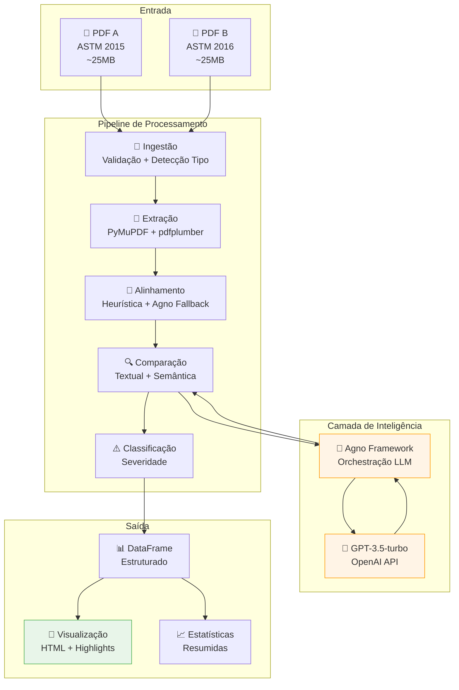
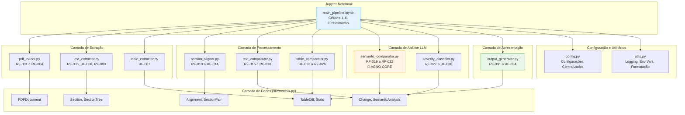
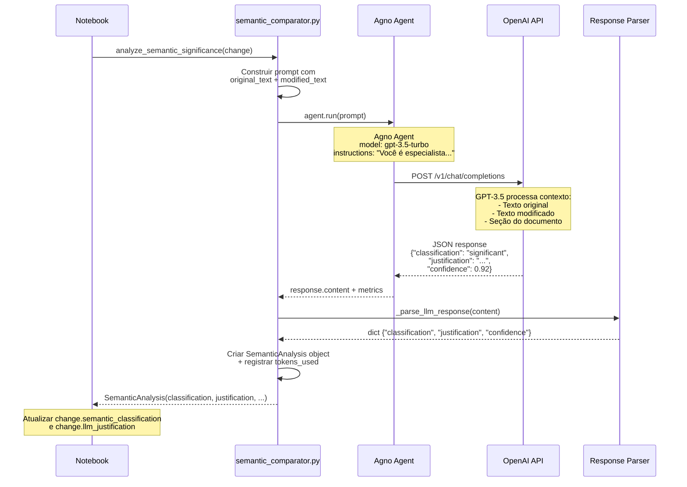
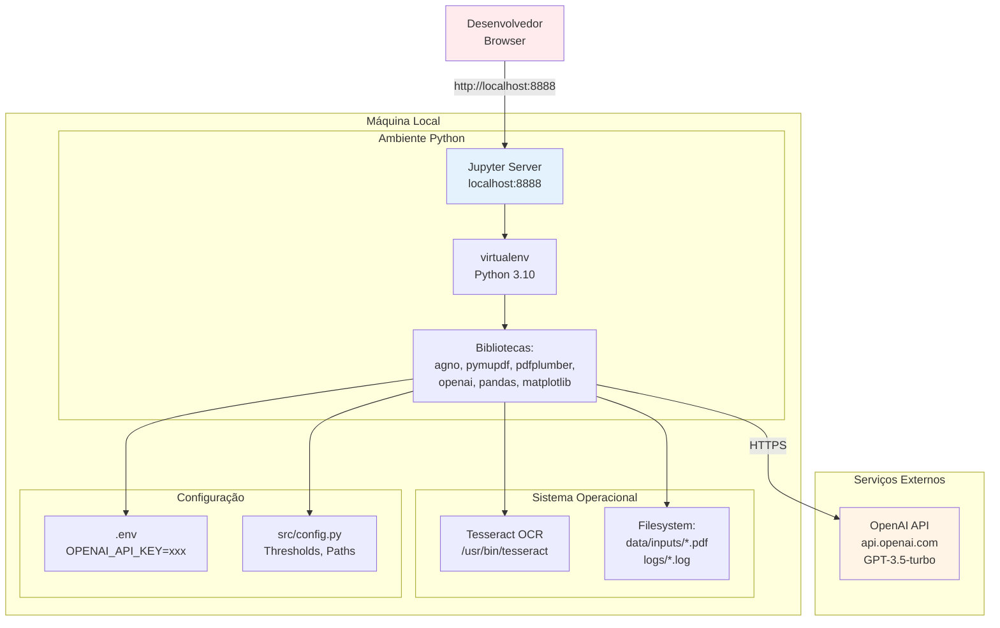
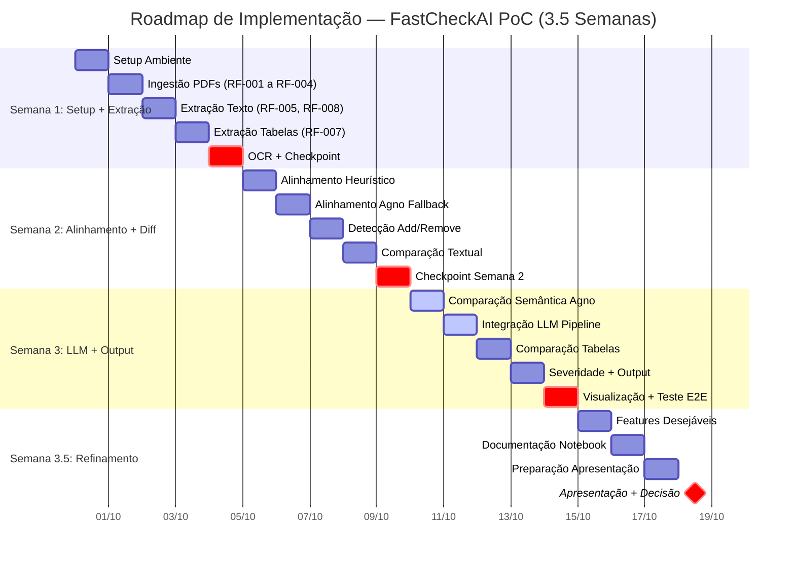
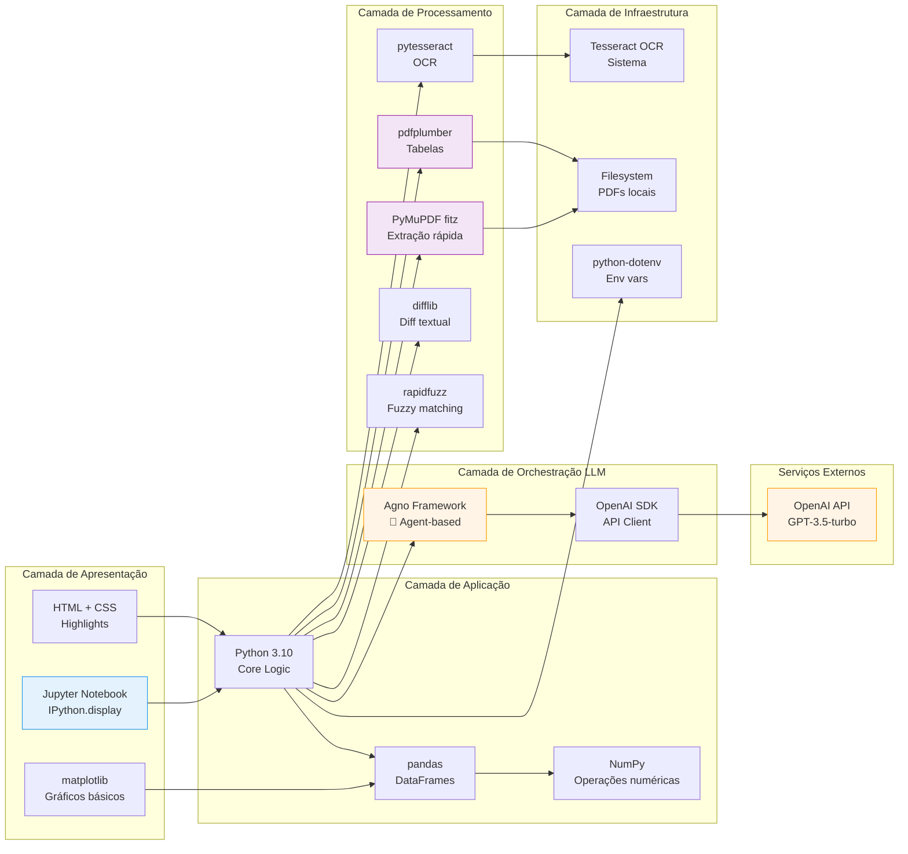

# Diagramas Visuais da Arquitetura — FastCheckAI PoC

**Versão:** 1.0
**Data:** 30 de Setembro de 2025
**Complemento:** architecture_decision.md

---

## 1. Visão Geral da Arquitetura (High-Level)



---

## 2. Fluxo de Dados Detalhado (Data Flow)

```mermaid
flowchart LR
    subgraph "Stage 1: Ingestão"
        A1[Carregar PDF A]
        A2[Carregar PDF B]
        A3{Validar<br/>Tamanho ≤25MB?}
        A4[Detectar Tipo<br/>Nativo/Escaneado]
    end

    subgraph "Stage 2: Extração"
        B1{PDF Nativo?}
        B2[PyMuPDF<br/>Extração Rápida]
        B3[pytesseract<br/>OCR]
        B4[Parsear<br/>Hierarquia Seções]
        B5{Tabelas<br/>Detectadas?}
        B6[pdfplumber<br/>Extração Seletiva]
    end

    subgraph "Stage 3: Alinhamento"
        C1[Match Exato<br/>por ID]
        C2[Fuzzy Match<br/>por Título]
        C3{Confiança<br/>≥0.8?}
        C4[Agno LLM<br/>Sugestão]
        C5[Mapeamento Final<br/>A ↔ B]
    end

    subgraph "Stage 4: Comparação"
        D1[Diff Textual<br/>difflib]
        D2[Categorizar<br/>Add/Remove/Modify]
        D3[Agno + GPT-3.5<br/>Análise Semântica]
        D4[Comparar<br/>Tabelas]
    end

    subgraph "Stage 5: Output"
        E1[Classificar<br/>Severidade]
        E2[Gerar DataFrame]
        E3[Calcular Stats]
        E4[Visualização HTML]
    end

    A1 --> A3
    A2 --> A3
    A3 -->|OK| A4
    A4 --> B1

    B1 -->|Sim| B2
    B1 -->|Não| B3
    B2 --> B4
    B3 --> B4
    B4 --> B5

    B5 -->|Sim| B6
    B5 -->|Não| C1
    B6 --> C1

    C1 --> C2
    C2 --> C3
    C3 -->|Não| C4
    C3 -->|Sim| C5
    C4 --> C5

    C5 --> D1
    D1 --> D2
    D2 --> D3
    D2 --> D4
    D3 --> E1
    D4 --> E1

    E1 --> E2
    E2 --> E3
    E2 --> E4

    style D3 fill:#fff4e6
    style C4 fill:#fff4e6
    style E4 fill:#e8f5e9
```



---

## 3. Arquitetura de Módulos (Estrutura de Código)



---

## 4. Integração Agno (Detalhamento Técnico)



---

## 5. Estratégia de Alinhamento Híbrido

```mermaid
flowchart TD
    Start([Início: 2 SectionTrees]) --> Step1

    Step1[Etapa 1: Match Exato por ID]
    Step1 --> Check1{Seções com<br/>ID idêntico?}
    Check1 -->|Sim| Match1[Adicionar ao Alignment<br/>confidence=1.0<br/>method='exact_match']
    Check1 -->|Não| Step2

    Match1 --> Step2

    Step2[Etapa 2: Fuzzy Match por Título]
    Step2 --> Unmatched{Seções não<br/>alinhadas?}
    Unmatched -->|Sim| Fuzzy[rapidfuzz.process.extractOne<br/>threshold=0.8]
    Unmatched -->|Não| CalcStats

    Fuzzy --> Check2{Score ≥ 0.8?}
    Check2 -->|Sim| Match2[Adicionar ao Alignment<br/>confidence=score<br/>method='fuzzy_title']
    Check2 -->|Não| Step3

    Match2 --> Step3

    Step3[Etapa 3: Calcular Confiança Média]
    Step3 --> CalcStats[alignment.avg_confidence<br/>= sum(confidence) / len(pairs)]

    CalcStats --> Check3{Confiança<br/>Média < 0.8?}

    Check3 -->|Não| Final[Retornar Alignment]
    Check3 -->|Sim| LLM[Etapa 4: LLM Fallback via Agno]

    LLM --> Prompt[Construir prompt:<br/>'Seções não alinhadas de A: X, Y, Z<br/>Seções disponíveis em B: M, N, O<br/>Sugira correspondências']

    Prompt --> AgnoCall[agno_agent.run(prompt)]
    AgnoCall --> ParseLLM[Parsear JSON response:<br/>suggestions = [...]]

    ParseLLM --> Merge[Adicionar sugestões ao Alignment<br/>confidence=llm_confidence<br/>method='llm_suggested']

    Merge --> Final

    Final --> End([Fim: Alignment Completo])

    style Match1 fill:#c8e6c9
    style Match2 fill:#c8e6c9
    style LLM fill:#fff4e6
    style AgnoCall fill:#fff4e6
    style Final fill:#e3f2fd
```

---

## 6. Pipeline de Comparação Semântica (LLM)

```mermaid
flowchart LR
    subgraph "Input"
        C1[Change Object:<br/>- original_text<br/>- modified_text<br/>- section_title<br/>- change_type]
    end

    subgraph "Prompt Engineering"
        P1[Template:<br/>'Analise a seguinte mudança...<br/>Original: {original}<br/>Modificado: {modified}<br/>Contexto: {section}']
        P2[Instruções:<br/>'Classifique como:<br/>- equivalent<br/>- minor<br/>- significant']
        P3[Output Format:<br/>JSON com campos:<br/>classification, justification, confidence]
    end

    subgraph "Agno Orchestration"
        A1[Agno Agent]
        A2[Model: gpt-3.5-turbo]
        A3[Max Tokens: 4000]
        A4[Temperature: 0.3<br/>Respostas consistentes]
    end

    subgraph "LLM Processing"
        L1[GPT-3.5 Analisa:<br/>1. Similaridade semântica<br/>2. Contexto técnico<br/>3. Impacto em requisitos]
        L2[Gera Resposta:<br/>JSON estruturado]
    end

    subgraph "Post-Processing"
        PP1[Parsear JSON]
        PP2[Validar campos obrigatórios]
        PP3{Confidence<br/>≥ 0.7?}
        PP4[Criar SemanticAnalysis]
        PP5[Registrar tokens + custo]
    end

    subgraph "Output"
        O1[SemanticAnalysis:<br/>- classification<br/>- justification<br/>- confidence<br/>- tokens_used<br/>- timestamp]
    end

    C1 --> P1
    P1 --> P2
    P2 --> P3
    P3 --> A1

    A1 --> A2
    A2 --> A3
    A3 --> A4
    A4 --> L1

    L1 --> L2
    L2 --> PP1
    PP1 --> PP2
    PP2 --> PP3

    PP3 -->|Sim| PP4
    PP3 -->|Não| Retry[Retry com<br/>temperatura ajustada]
    Retry --> A1

    PP4 --> PP5
    PP5 --> O1

    style A1 fill:#fff4e6
    style L1 fill:#fff4e6
    style O1 fill:#e8f5e9
```

---

## 7. Estrutura de Células do Notebook

```mermaid
graph TD
    subgraph "main_pipeline.ipynb"
        C0[Célula 0: Setup e Imports<br/>sys.path.append, imports]
        C1[Célula 1: Configuração<br/>PDF_PATHS, API_KEYS, thresholds]
        C2[Célula 2: Carregamento<br/>load_pdf x2, validação]
        C3[Célula 3: Extração de Texto<br/>PyMuPDF/OCR, parse_hierarchy]
        C4[Célula 4: Extração de Tabelas<br/>detect_tables, pdfplumber]
        C5[Célula 5: Alinhamento<br/>heuristic + LLM fallback]
        C6[Célula 6: Comparação Textual<br/>compute_diff, categorize_changes]
        C7[Célula 7: Comparação Semântica<br/>🧠 Agno + GPT-3.5 loop]
        C8[Célula 8: Comparação de Tabelas<br/>compare_tables, cell_diff]
        C9[Célula 9: Classificação Severidade<br/>aplicar regras CRÍTICA/MÉDIA/BAIXA]
        C10[Célula 10: Geração Output<br/>DataFrame + Stats]
        C11[Célula 11: Visualização<br/>🎨 HTML + display]
    end

    C0 --> C1
    C1 --> C2
    C2 --> C3
    C3 --> C4
    C4 --> C5
    C5 --> C6
    C6 --> C7
    C7 --> C8
    C8 --> C9
    C9 --> C10
    C10 --> C11

    C2 -.->|Salva| D1[(PDFDocument A, B)]
    C3 -.->|Salva| D2[(SectionTree A, B)]
    C4 -.->|Salva| D3[(Tables A, B)]
    C5 -.->|Salva| D4[(Alignment)]
    C6 -.->|Salva| D5[(List[Change])]
    C7 -.->|Atualiza| D5
    C8 -.->|Adiciona| D5
    C9 -.->|Atualiza| D5
    C10 -.->|Gera| D6[(DataFrame + Stats)]
    C11 -.->|Renderiza| D7[Visualização Final]

    style C1 fill:#e3f2fd
    style C7 fill:#fff4e6
    style C11 fill:#e8f5e9
    style D7 fill:#e8f5e9
```

---

## 8. Diagrama de Deployment (Local Notebook)



---

## 9. Cronograma Visual (Gantt)



---

## 10. Matriz de Tecnologias (Stack Visual)



---

## 11. Fluxo de Decisão (Alinhamento + LLM)

```mermaid
flowchart TD
    Start([2 PDFs Carregados]) --> Extract[Extração de Texto<br/>+ Hierarquia]

    Extract --> Compare[Iniciar Alinhamento]

    Compare --> Q1{Seções têm<br/>ID idêntico?}
    Q1 -->|Sim| Exact[Match Exato<br/>confidence=1.0]
    Q1 -->|Não| Q2{Títulos similares<br/>≥80%?}

    Q2 -->|Sim| Fuzzy[Fuzzy Match<br/>confidence=score]
    Q2 -->|Não| Unmatched[Marcar como<br/>não alinhado]

    Exact --> CheckAvg
    Fuzzy --> CheckAvg
    Unmatched --> CheckAvg

    CheckAvg{Confiança média<br/>≥0.8?}
    CheckAvg -->|Sim| FinalAlign[Alinhamento OK<br/>Prosseguir]
    CheckAvg -->|Não| LLMDecision

    LLMDecision[Preparar prompt LLM<br/>com seções não alinhadas]
    LLMDecision --> AgnoCall[Agno agent.run]
    AgnoCall --> LLMResponse[GPT-3.5 sugere<br/>correspondências]
    LLMResponse --> ParseSuggestions[Parsear JSON<br/>+ validar]
    ParseSuggestions --> MergeSuggestions[Adicionar ao<br/>Alignment]
    MergeSuggestions --> FinalAlign

    FinalAlign --> DetectChanges[Seções adicionadas/<br/>removidas]
    DetectChanges --> TextDiff[Comparação Textual<br/>difflib]
    TextDiff --> SemanticQ{Mudança<br/>significativa?}

    SemanticQ -->|Trivial| IgnoreChange[Ignorar mudança]
    SemanticQ -->|Importante| SemanticAnalysis[Análise Semântica<br/>🧠 Agno + GPT-3.5]

    SemanticAnalysis --> Classify[Classificar:<br/>equivalent/minor/significant]
    Classify --> Severity[Determinar Severidade:<br/>CRITICAL/MEDIUM/LOW]

    Severity --> Output[Adicionar ao<br/>DataFrame de Resultados]
    IgnoreChange --> CheckMore{Mais<br/>mudanças?}
    Output --> CheckMore

    CheckMore -->|Sim| TextDiff
    CheckMore -->|Não| FinalOutput[Gerar Output<br/>Final]

    FinalOutput --> End([Visualização<br/>+ Estatísticas])

    style AgnoCall fill:#fff4e6
    style SemanticAnalysis fill:#fff4e6
    style FinalOutput fill:#e8f5e9
    style End fill:#e8f5e9
```



---

## 12. Arquitetura de Risco (Plano B)

```mermaid
graph TB
    Start([Início da Implementação]) --> Week1Check

    Week1Check{Fim Semana 1:<br/>Setup OK?}
    Week1Check -->|Sim| Week2Dev
    Week1Check -->|Não| Risk1

    Risk1[Risco: Agno não instala<br/>ou bugs críticos]
    Risk1 --> Mitigation1[PLANO B:<br/>OpenAI API Direta<br/>Esforço: 2-3h]
    Mitigation1 --> Week2Dev

    Week2Dev[Desenvolvimento<br/>Semana 2]
    Week2Dev --> Week2Check{Fim Semana 2:<br/>Alinhamento ≥90%?}

    Week2Check -->|Sim| Week3Dev
    Week2Check -->|Não| Risk2

    Risk2[Risco: Alinhamento falha<br/>em casos complexos]
    Risk2 --> Mitigation2[PLANO B:<br/>LLM-only alignment<br/>ou validação manual]
    Mitigation2 --> Week3Dev

    Week3Dev[Desenvolvimento<br/>Semana 3]
    Week3Dev --> Week3Check{Fim Semana 3:<br/>Pipeline E2E ≤3min?}

    Week3Check -->|Sim| Week35Dev
    Week3Check -->|Não| Risk3

    Risk3[Risco: Performance<br/>insuficiente]
    Risk3 --> Mitigation3[PLANO B:<br/>Paralelização PyMuPDF<br/>ou reduzir chamadas LLM]
    Mitigation3 --> Week35Dev

    Week35Dev[Refinamento<br/>Semana 3.5]
    Week35Dev --> FinalCheck{Dia 19:<br/>Demo funcional?}

    FinalCheck -->|Sim| Success[GO:<br/>Apresentação<br/>bem-sucedida]
    FinalCheck -->|Não| Risk4

    Risk4[Risco: Features<br/>incompletas]
    Risk4 --> Mitigation4[PLANO B:<br/>Demo com screenshots<br/>+ documentar limitações]
    Mitigation4 --> Decision

    Success --> Decision{Decisão<br/>Go/No-Go}
    Decision -->|GO| NextPhase[Planejamento MVP]
    Decision -->|NO-GO| Lessons[Documentar<br/>Lições Aprendidas]

    style Mitigation1 fill:#ffccbc
    style Mitigation2 fill:#ffccbc
    style Mitigation3 fill:#ffccbc
    style Mitigation4 fill:#ffccbc
    style Success fill:#c8e6c9
    style NextPhase fill:#c8e6c9
```



---

**FIM DOS DIAGRAMAS VISUAIS**

*Estes diagramas complementam o documento `architecture_decision.md` e devem ser consultados em conjunto.*